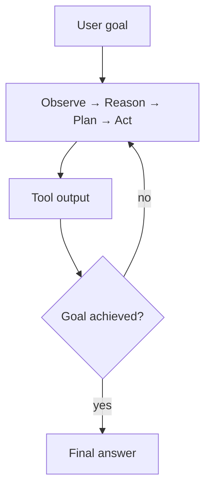

An AI agent reasons, plans, and calls tools to work through a multi-step task on its own. Where a chatbot answers one query at a time, an agent keeps going — observing results, deciding the next move — until the goal is met or it gives up.

## Agent vs Chatbot

| | Chatbot | Agent |
|---|---------|-------|
| **Interaction** | Single query → single response | Multi-step goal pursuit |
| **Tools** | None | Calls external functions, APIs, databases |
| **Planning** | None | Breaks down goals, sequences actions |
| **Memory** | Usually per-conversation | Can persist across sessions |
| **Autonomy** | Low — needs constant guidance | High — decides its own next steps |

## Core Capabilities

**Reasoning** — Think through problems before acting:
```
Task: "Book a flight to Paris next week"
Reasoning: Need departure city, exact dates, preferences, budget constraints
→ Ask user for missing information before acting
```

**Planning** — Break complex goals into steps:
```
Goal: Research competitor pricing
Plan:
  1. Search for competitor websites
  2. Extract pricing pages
  3. Normalize data format
  4. Compare with our pricing
  5. Generate summary report
```

**Tool Use** — Call external systems:
```python
tools = [search_web, read_file, calculate, run_query, send_email]
# Agent decides which tools to call, in what order, with what parameters
```

**Memory** — Maintain context across steps:
```python
agent_memory = {
    "working_memory": "current task state",
    "conversation_history": [...],
    "retrieved_facts": [...],
}
```

## The Agent Loop



The loop runs until the goal is achieved or a stop condition trips: a max step count, a confidence threshold, or a human stepping in. The [agentic RAG walkthrough](/interactive/agentic) steps through one turn of this cycle on a concrete retrieval task.

## When to Use Agents

**Good fit:**
- Tasks requiring multiple sequential steps
- Decisions that depend on intermediate results
- Problems needing external data or computation
- Workflows that vary based on what's discovered

**Poor fit:**
- Simple Q&A (use [RAG](/guides/what-is-rag))
- Fixed workflows (use regular code)
- Latency-critical paths (agents are slow)
- High-stakes actions without human review
