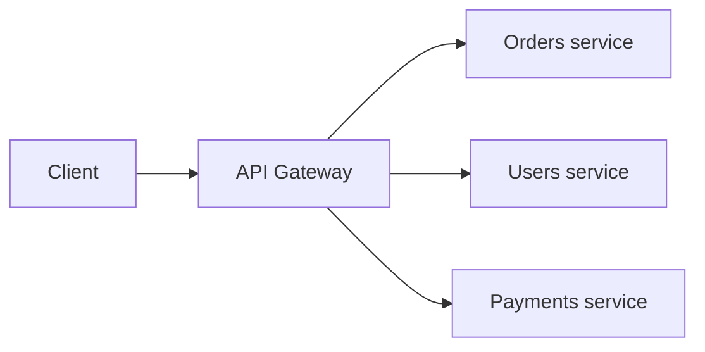

An API gateway sits in front of a system's backend services as the
single entry point every external request passes through, centralizing
concerns that would otherwise be duplicated in every individual
service.

## What it actually does

- **Routing** — maps incoming paths to the right backend service
  (`/orders/*` → orders service), so clients don't need to know the
  internal service topology at all, and that topology can change without
  clients noticing.
- **Authentication** — verifies who's calling once, at the edge, rather
  than every downstream service independently re-implementing JWT
  verification or API key checks — see
  [APIs: Best Practices](/guides/api-best-practices) for the actual
  auth mechanics this centralizes.
- **Rate limiting** — enforces per-client limits in one place; see
  [Rate Limiting](/nuggets/rate-limiting) for the algorithms a gateway
  typically implements this with.
- **Logging & observability** — every request passes through one
  chokepoint, which is a natural place to attach the request id and
  emit the request-level metrics/traces described in
  [Observability](/nuggets/observability).

## Why centralize this instead of per-service

Without a gateway, every backend service needs its own auth
verification, rate limiting, and logging: duplicated logic, and
duplicated risk of one service implementing it slightly wrong. A gateway
also means backend services can be genuinely internal (not
individually exposed to the internet, not individually needing TLS
termination or public-facing hardening), since only the gateway is
public-facing.

## The cost

A gateway is a new critical-path component — every request passes
through it, so its own availability and latency budget matter as much
as any backend service's, and it can become a bottleneck or single
point of failure if not itself made highly available (typically behind
a [load balancer](/guides/networking-load-balancing) with multiple
gateway instances, not one). It also adds a network hop's worth of
latency to every request, which matters more for latency-sensitive
internal service-to-service calls than for public API traffic.

## Where it applies

Any system with multiple backend services behind one public surface.
Almost every microservices architecture uses one, both for the reasons
above and because it's the natural place to enforce a consistent API
contract across services that might otherwise each drift toward
inconsistent conventions. Pairing an API gateway with
[serverless functions](/guides/serverless-aws-lambda) as the backend
(API Gateway routing directly to Lambda, with no server running between
requests) is one of the most common shapes a small API takes.

## What it buys you

Nothing here is capability a single service couldn't implement on its
own — auth, rate limiting, routing, and logging can all be built into
each backend individually. What a gateway actually buys is centralizing
those correctness-critical concerns in one place, instead of trusting
every team owning a different backend service to reimplement them
identically and get all of them right.
