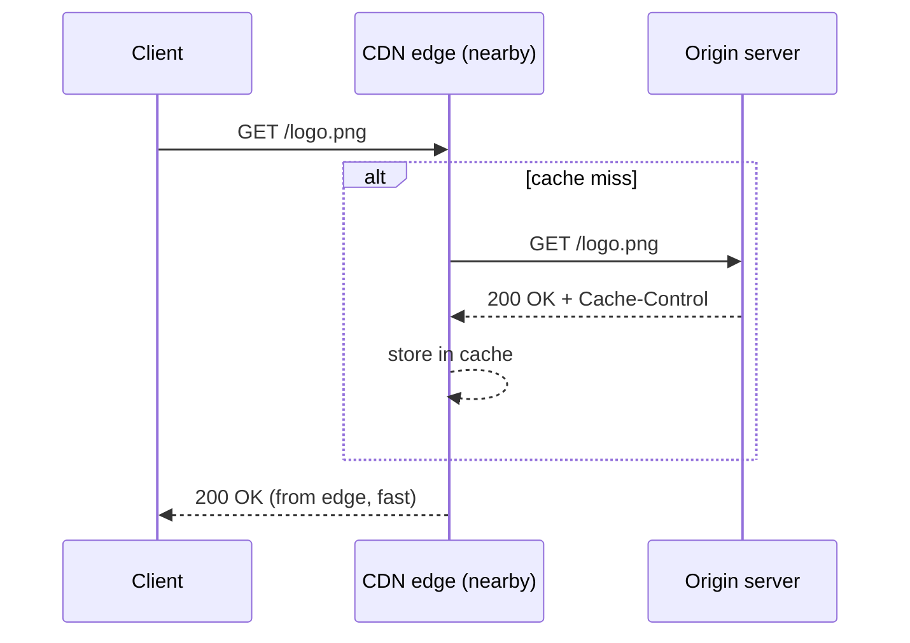

A **CDN** (Content Delivery Network) caches content at servers
geographically distributed close to readers — "edge" locations — so a
request doesn't have to round-trip all the way to a single origin
server on every request.

## Why it matters

[Numbers Every Engineer Should Know](/nuggets/numbers-every-engineer-should-know)
puts a cross-continent round trip around 150ms, before any actual
work happens on the response. A CDN turns that into a much shorter trip
to a nearby edge location instead, for anything the edge already has
cached. At scale, it also simply absorbs traffic: a viral asset served
from a hundred edge locations doesn't concentrate all that load onto one
origin server.

## How it works

- **Origin pull** (the common default) — the edge fetches from the
  origin on the first request for an object (a cache miss) and serves
  from cache on every subsequent one, until it expires.
- **Origin push** — content is proactively uploaded to edge locations
  ahead of any request, common for large, known-popular assets (a
  software release, a video premiere) where the first-request latency
  penalty of origin pull isn't acceptable.

## Cache-Control governs everything

A CDN is a cache, and it obeys exactly the same headers described in
[APIs: Best Practices](/guides/api-best-practices)'s caching section:
`Cache-Control` tells the edge how long it may serve a response without
re-checking the origin, and `ETag`/conditional requests let it
revalidate cheaply instead of re-downloading. Getting this wrong in
either direction is a real cost: too short a TTL means the CDN barely
helps (constant origin re-fetches); too long means stale content serves
long after the origin changed. It's the exact tradeoff
[Cache vs. Freshness](/nuggets/cache-vs-freshness) describes generally,
just now with a globally-distributed cache instead of a single one.

## Static vs. dynamic content

CDNs are the obvious fit for genuinely static assets (images, JS/CSS
bundles, video) that are identical for every viewer. Modern CDNs also
accelerate *dynamic*, per-user content by running compute at the edge
(edge functions) or simply optimizing the network path to origin even
when the response itself can't be cached. The connection setup and
routing improvements still help even for a response that's never
cacheable.

## Where it applies

Any content served to geographically distributed users: web assets,
video streaming, API responses that are the same across users (public
product catalogs, not personalized feeds), and as a first line of
defense absorbing traffic spikes before they ever reach the origin.

## Where to go from here

A CDN's help is limited to requests a cache can actually serve; how the
origin itself scales is a separate problem. For that, see
[Scaling Reads vs. Scaling Writes](/nuggets/scaling-reads-vs-scaling-writes).
