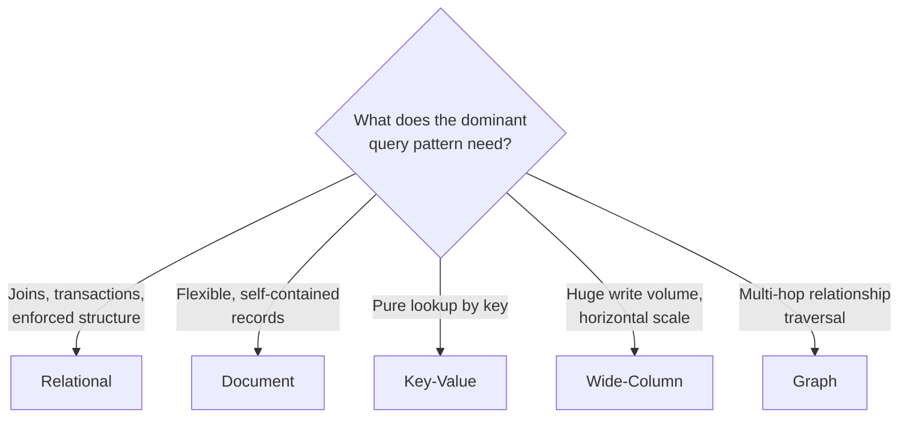

Choosing how data is shaped and stored is one of the highest-leverage
decisions in a system design — harder to change later than almost
anything else, since every access pattern built on top of a schema
inherits its constraints. This guide covers choosing a database model,
schema design, and normalization; for the specific SQL-vs-NoSQL
consistency and scaling tradeoff, see
[SQL vs. NoSQL](/nuggets/sql-vs-nosql).

## Choosing a database model

- **Relational** — fixed schema, strong relationships enforced by the
  database (foreign keys, constraints), full ACID transactions. Best
  when data has genuine structure and relationships that matter (an
  order needs a valid customer; a payment needs a valid order) and you
  want the database itself to enforce that, not application code.
- **Document** — each record is a flexible, often nested JSON-like blob.
  Best when records are naturally self-contained and don't need to be
  joined against each other on every read (a user profile, a product
  catalog entry).
- **Key-value** — the simplest model: look up a value by an exact key,
  nothing else. Best for pure lookup-by-id access patterns (a session
  store, a feature flag cache) where you'd never query by anything but
  the key.
- **Wide-column** — rows can have different columns, and the schema is
  optimized for very high write throughput and horizontal scale over
  strict relationships. Best for time-ordered or write-heavy data at
  large scale (see [DynamoDB & Cassandra](/guides/dynamodb-and-cassandra)).
- **Graph** — nodes and edges are first-class, and traversing
  relationships (friends-of-friends, recommendation paths) is the
  primary query pattern, done efficiently because the database indexes
  relationships directly rather than computing joins on the fly. Best
  when the *relationships between* entities, not just the entities
  themselves, are what queries actually need — a relational database
  can model a graph, but a multi-hop traversal query degrades badly as
  join depth grows.

## Schema design by access pattern

The right schema follows from how data will actually be *queried*, not
just what the data conceptually "is." Two apps with identical entities
(users, posts, comments) can want opposite schemas if one mostly reads a
single post with all its comments at once (favoring denormalized,
embedded comments) and the other mostly queries comments independently
across posts (favoring a normalized, separately-queryable table). Design
the schema around the three or four queries that will actually run most
often, not around a theoretically "correct" entity model.

## Normalization vs. denormalization

- **Normalized** — each fact stored exactly once, related via foreign
  keys, joined at query time. No update anomalies (change a customer's
  name once, every order referencing them sees it), at the cost of a
  join on every read that touches related data.
- **Denormalized** — related data is duplicated inline, avoiding the
  join at read time, at the cost of needing to keep every copy in sync
  when the source of truth changes.

Denormalization is the right call for read-heavy, rarely-updated data
(analytics rollups, event logs, a product listing snapshot) where the
join cost on every read outweighs the sync cost on the rare write.
Caching a computed join result is often a better middle ground than
denormalizing the schema itself — see
[Cache Invalidation](/nuggets/cache-invalidation) for keeping that
cache correct.

## Scaling a schema

Once one database instance isn't enough, the schema itself has to
support being split — see [Sharding Strategies](/nuggets/sharding-strategies)
for choosing a shard key that matches the same dominant-access-pattern
principle this guide starts from.

## Where to go from here

A schema decision made early tends to be the most expensive one to
reverse. See [Expand-Contract Pattern](/nuggets/expand-contract) for
how to actually migrate a schema safely once it needs to change.
