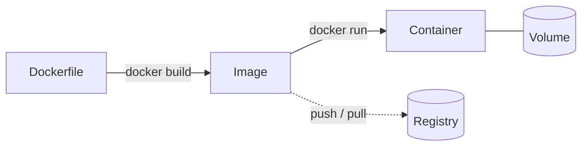
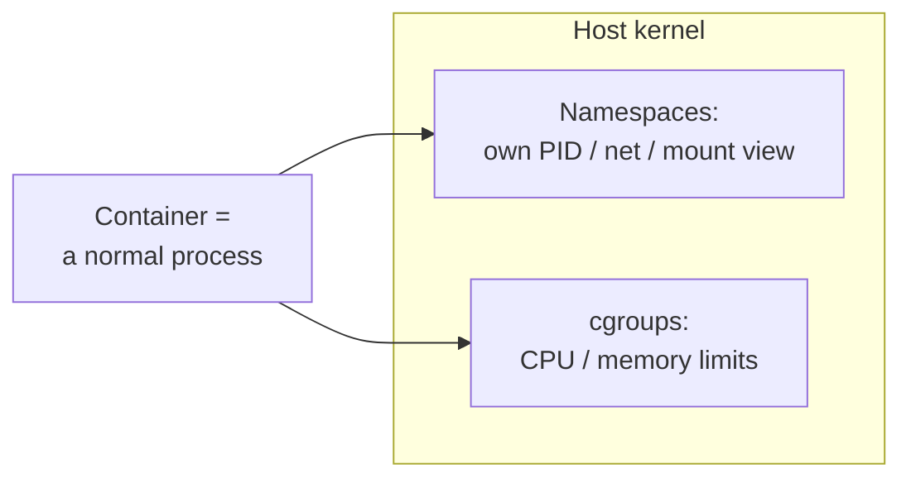

A from-zero walkthrough for someone who's never used Docker: the core
mental model, how to get it installed, where things live in both Docker
Desktop and the terminal, and the handful of commands and gotchas that
cover almost everything you'll do day to day.

## Why Docker

Docker packages an application together with everything it needs to run
(runtime, libraries, system dependencies) into a single unit that behaves
the same on your laptop, a teammate's laptop, and a production server. It
solves "works on my machine": if it runs in the container, it runs the
same way everywhere the container runs, because the container *is* the
machine as far as the app can tell.

## Core concepts

Four terms cover almost everything:

- **Image** — a read-only, versioned snapshot of a filesystem plus the
  command to run: your app's code, its dependencies, and the instructions
  for how to start it. Immutable — you don't edit an image, you build a
  new one.
- **Container** — a running (or stopped) instance of an image, with its
  own writable filesystem layer on top. You can run many containers from
  the same image at once, each isolated from the others.
- **Volume** — a place for data a container writes that should outlive the
  container itself (a database's files, uploaded assets). Deleting a
  container never deletes its volumes.
- **Registry** — where images are stored and shared (Docker Hub is the
  public default). `push` sends an image there, `pull` fetches one down.



## Under the hood: namespaces and cgroups

Underneath, a container is just an ordinary Linux process, not a
lightweight VM: there's no separate kernel or virtualized hardware
involved. Two kernel features make it merely *look* isolated:

- **Namespaces** give a process its own view of something that's normally
  global on the machine. The **PID namespace** makes a container's first
  process look like PID 1, unaware anything outside it exists. The
  **network namespace** gives it its own network interfaces, IP address,
  and routing table. The **mount namespace** gives it its own filesystem
  view: the image's filesystem, not the host's. A few others (UTS for
  hostname, IPC, user namespaces for UID remapping) round it out.
  Together, this is what "isolated" actually means.
- **cgroups** (control groups) *limit* what a process can use (CPU
  shares, memory, I/O bandwidth) rather than hiding things from it. This
  is what stops one container from starving every other process on the
  host of CPU or memory.



This is also why a container starts in milliseconds while a VM takes
seconds: a container is just `fork`/`exec` plus these two kernel
features applied to the new process; there's no separate kernel or
hardware to boot. It's also why every container on a host shares that
host's kernel. A Linux container image can't run natively on a non-Linux
kernel, which is exactly why Docker Desktop on macOS/Windows runs a small
Linux VM under the hood: something has to actually provide that kernel.

## Installing Docker

- **macOS / Windows**: install **Docker Desktop**. It bundles the Docker
  engine (which actually runs containers), the `docker` CLI, and a GUI.
  On both platforms the engine runs inside a lightweight Linux VM Docker
  Desktop manages for you, since containers are a Linux kernel feature.
- **Linux**: install **Docker Engine** directly (no VM needed — the kernel
  containers rely on is already there) via your distro's package manager.
  Docker Desktop is also available on Linux if you want the GUI, but it's
  optional there.

Either way, `docker --version` and `docker run hello-world` are the
standard "did it actually work" check once installed.

## Docker Desktop: where everything lives

The GUI mirrors the CLI concepts directly:

- **Containers** tab — every container, running or stopped, with start,
  stop, and log-viewing controls per row. This is the fastest way to
  answer "what's currently running on my machine."
- **Images** tab — every image pulled or built locally, with disk space
  used and a delete action. This is usually where "why is my disk full"
  gets answered.
- **Volumes** tab — named volumes and how much space each is using.
- The menu-bar/tray whale icon shows engine status at a glance and is
  where you'd restart the engine if it's stuck.
- **Settings → Resources** controls how much CPU/memory/disk the VM
  (macOS/Windows) is allowed to use — worth raising if builds feel starved
  on a machine that clearly has the headroom.

Everything the GUI shows is also queryable from the terminal: the GUI is
a view onto the same engine, not a separate thing.

## The CLI: essential commands

| Command | What it does |
| --- | --- |
| `docker build -t myapp .` | Build an image named `myapp` from the `Dockerfile` in the current directory |
| `docker images` | List images stored locally |
| `docker run -d -p 8080:80 --name web myapp` | Start a container in the background (`-d`), mapping host port 8080 to the container's port 80 |
| `docker ps` | List *running* containers |
| `docker ps -a` | List *all* containers, including stopped ones |
| `docker logs -f web` | Stream a container's stdout/stderr (`-f` follows, like `tail -f`) |
| `docker exec -it web sh` | Open an interactive shell inside a running container |
| `docker stop web` | Stop a running container |
| `docker rm web` | Remove a stopped container |
| `docker rmi myapp` | Remove an image |
| `docker volume ls` | List named volumes |
| `docker system prune` | Remove stopped containers, unused networks, and dangling images in one pass |

`docker ps` empty but you *know* something's running is almost always
because it stopped — check `docker ps -a` and then `docker logs` on it to
see why.

## Writing a Dockerfile

```dockerfile
FROM node:24-slim
WORKDIR /app

# Copy just the dependency manifest first — this layer only rebuilds
# when package.json actually changes, so unrelated code edits don't
# force a full npm ci on every build.
COPY package.json package-lock.json ./
RUN npm ci --omit=dev

COPY . .
EXPOSE 3000
CMD ["node", "server.js"]
```

Each instruction is a cached layer; Docker only rebuilds from the first
line that actually changed. Ordering instructions from least- to
most-frequently-changing (dependencies before app code, as above) is what
makes rebuilds fast during day-to-day development.

## Running multiple services with Docker Compose

Real apps are rarely one container — a backend plus a database plus a
cache, at minimum. `docker compose` describes the whole set in one file
and starts them together, already networked so they can reach each other
by service name:

```yaml
services:
  app:
    build: .
    ports:
      - '3000:3000'
    environment:
      - DATABASE_URL=postgres://postgres:postgres@db:5432/app
    depends_on:
      - db

  db:
    image: postgres:18
    environment:
      - POSTGRES_PASSWORD=postgres
    volumes:
      - db-data:/var/lib/postgresql/data

volumes:
  db-data:
```

`docker compose up -d` starts both; `app` reaches `db` at the hostname
`db` (Compose sets up a private network and DNS between services
automatically — no manual IP configuration). `docker compose down` stops
and removes the containers; add `-v` to also remove the named volume, if
you actually want to wipe the database.

## Volumes vs. bind mounts: where your data actually lives

- A **named volume** (`db-data:/var/lib/postgresql/data` above) is managed
  by Docker itself, lives outside any container's writable layer, and
  survives `docker rm` on the container that used it. Use this for data
  the app owns and needs to persist — a database's files, in the example
  above.
- A **bind mount** (`./src:/app/src`) maps a path on your actual machine
  into the container. Use this for local development, so edits to source
  files on your host are immediately visible inside the running
  container without rebuilding the image.

Mixing these up is the source of two common confusions: "I deleted the
container and lost my database" (should have been a named volume) and
"I rebuilt the image but my code changes aren't showing up" (should have
been a bind mount, or you forgot to rebuild).

## Container security basics

A few habits worth having well before "at scale" matters:

- **Don't run as root inside the container.** By default a container's
  process runs as root (uid 0) unless told otherwise: harmless for quick
  local use, but a real gap if that process is ever compromised, since a
  container-to-host escape as root is far more dangerous than one as an
  unprivileged user. Add a non-root user in the Dockerfile and switch to
  it before `CMD` runs:

  ```dockerfile
  RUN adduser --disabled-password appuser
  USER appuser
  ```

- **Start from a minimal base image.** `node:24-slim` is already smaller
  than the full `node:24`; `-alpine` variants (or distroless images,
  which contain nothing but the app and its runtime — no shell, no
  package manager) go further. Less in the image means fewer known
  vulnerabilities shipped along with it, and less an attacker can do with
  a shell if they ever get one.
- **Never bake secrets into an image.** A value set with `ENV` or `ARG` in
  a Dockerfile is visible to anyone who can run `docker history` or pull
  the image, including from intermediate build-cache layers, even if a
  later instruction overwrites it. Pass secrets at runtime instead
  (`docker run -e`, Compose's `environment`/`env_file`, or a real secrets
  manager in production), never as a value committed into the Dockerfile.
- **Scan images for known vulnerabilities** before shipping (`docker
  scout` ships with Docker Desktop; Trivy and Grype are common standalone
  alternatives). A base image that was clean when the Dockerfile was
  written can accumulate newly-discovered CVEs over time in layers that
  haven't changed at all.

## Common gotchas

- **"Port is already allocated"** — something on the host (often a
  previous container you forgot was running) already owns that port.
  `docker ps` to find it, or pick a different host-side port in `-p`.
- **Forgetting `-d`** — without it, `docker run` attaches to your
  terminal and blocks; `Ctrl+C` stops the container, it doesn't just
  detach from it.
- **Disk filling up over time** — stopped containers, unused images, and
  build cache all accumulate. `docker system prune` (or Docker Desktop's
  "Clean up" action) reclaims it.
- **No `.dockerignore`** — without one, `COPY . .` sends everything in the
  directory to the build context, including `node_modules` and `.git`,
  bloating both build time and image size. Add one like you would a
  `.gitignore`.
- **"It works when I run it locally but not in the container"** — almost
  always an environment difference the container is correctly exposing:
  a missing environment variable, a config file that exists on your host
  but wasn't copied in, or a service the app expects to reach at
  `localhost` that's actually a separate container now (use the service
  name from Compose instead).

## Where to go from here

Everything above covers a single host running a handful of containers:
enough for local development, and enough to understand how a lot of real
infrastructure works under the hood. Running many containers reliably
across many machines, with scheduling, self-healing, and rolling
deploys, is a separate, much bigger topic (Kubernetes and friends),
deliberately out of scope for a getting-started guide.
