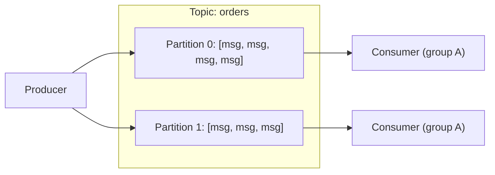

Kafka is a distributed **log** — not a traditional queue — and that
distinction shapes almost everything about how and when it's the right
tool.

## Topics, partitions, and offsets

Messages are published to a **topic**, which is split into
**partitions** for parallelism — each partition is an ordered,
append-only log, and a message's position in it is its **offset**.
Order is only guaranteed *within* a partition, not across the whole
topic, which is why the partition key (what determines which partition
a message lands on) matters as much as a database's shard key does —
see [Sharding Strategies](/nuggets/sharding-strategies) for the same
underlying tradeoff.

## Producers, consumers, and consumer groups

Producers write to a topic; consumers read from it, tracking their own
offset (how far they've read) rather than the broker removing messages
once delivered. Multiple consumers can form a **consumer group**, and
Kafka automatically splits the topic's partitions across them — each
partition is read by exactly one consumer within a group at a time,
which is how Kafka parallelizes consumption while still preserving
per-partition order.

## Why not just a traditional queue

A traditional queue (SQS, RabbitMQ) typically **removes** a message once
it's been consumed and acknowledged — one message, one logical
consumption. Kafka instead **retains** messages for a configured period
(hours to indefinitely) regardless of whether anyone's read them yet,
and multiple independent consumer groups can each read the same topic
from their own offset, entirely independently. This is what makes Kafka
a natural fit for **event streaming** — the same order-created event can
feed a fulfillment service, an analytics pipeline, and a notification
service, each consuming at its own pace, from the same retained log —
rather than a single point-to-point handoff.

## Where it applies

- **Event-driven architectures** — the relay target for
  [the Outbox Pattern](/nuggets/outbox-pattern)'s unsent-event table, or
  the destination stream for [Change Data Capture](/nuggets/change-data-capture).
- **Stream processing** — feeding a system (often paired with Flink or
  Kafka Streams) that computes over data continuously rather than in
  scheduled batches.
- **Decoupling producers from consumers** at high volume — a producer
  publishing at its own rate without needing consumers to keep up in
  real time, since the log retains what hasn't been read yet.

## Where to go from here

Kafka guarantees ordering only within a partition and delivery is
at-least-once by default — consumers need to be
[idempotent](/nuggets/idempotency) for exactly the same reason any
at-least-once system does.
