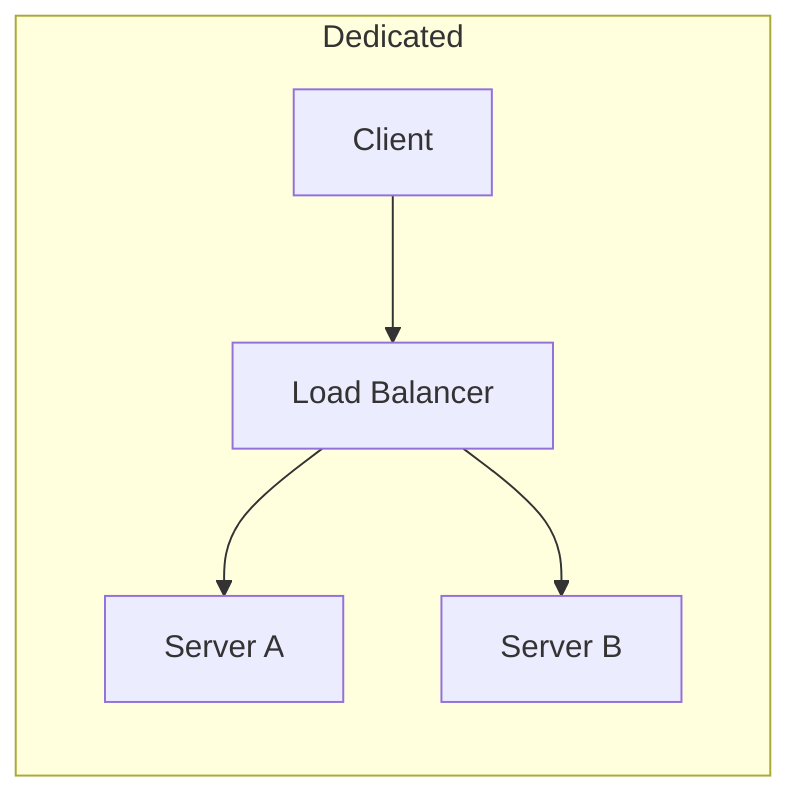
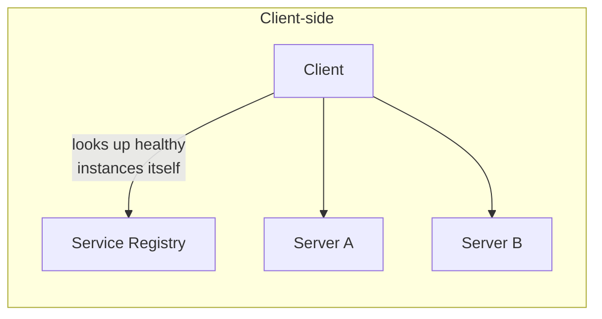

Once there's more than one server, something has to decide which
request goes where. This guide covers how — for the transport-level
mechanics a load balancer sits on top of, see
[Networking: Protocols](/guides/networking-protocols).

## Layer 4 vs. Layer 7

- **L4 (transport layer)** — routes based on IP address and port alone,
  without looking at the actual request content. Fast (minimal work per
  packet) and protocol-agnostic (works for anything over TCP/UDP, not
  just HTTP), but it can't make a routing decision based on, say, a URL
  path or a header.
- **L7 (application layer)** — terminates the connection and reads the
  actual request (HTTP method, path, headers, cookies) before deciding
  where to send it. Slower per-request (more work, and it has to
  understand the protocol), but enables routing like "send `/api/*` to
  the API fleet and `/static/*` to the CDN," and content-based decisions
  L4 simply can't see.

## Algorithms

- **Round robin** — cycle through servers in order. Simple, assumes all
  servers and all requests cost roughly the same.
- **Least connections** — send the next request to whichever server
  currently has the fewest active connections. Better than round robin
  when requests have very different processing times, since it adapts
  to actual load rather than just counting turns.
- **Weighted (round robin or least-connections)** — give some servers a
  higher share of traffic, typically because they have more capacity
  (a bigger instance type) or are being gradually ramped up (a canary
  deploy).
- **IP hash** — route based on a hash of the client's IP, so the same
  client consistently lands on the same server. Useful for **sticky
  sessions** when session state lives on one server's memory rather than
  a shared store — though a shared session store is usually the better
  fix, since IP hash breaks the moment a client's IP changes (switching
  networks) or a server goes down (rehashes everyone behind it).

## Health checks

A load balancer only helps if it stops sending traffic to a server
that's actually broken — it periodically pings each backend (an HTTP
`/health` endpoint, or just a TCP connect) and pulls any server that
stops responding out of rotation automatically. This is what turns "one
server crashed" into "a brief capacity dip" instead of "some fraction of
requests time out forever."

## Client-side vs. dedicated load balancing

- **Dedicated load balancer** — a separate piece of infrastructure (a
  hardware appliance, or software like NGINX/HAProxy/a cloud LB) that
  every request passes through. Simple mental model, but it's a single
  additional hop, and can itself become a bottleneck or single point of
  failure if not made highly available.
- **Client-side load balancing** — the calling service itself holds a
  list of healthy backend instances (via a **service registry** it
  queries or subscribes to) and picks one directly, no intermediary hop.
  Common in service-mesh architectures for internal service-to-service
  calls, where the extra hop of a dedicated LB adds latency that adds up
  across many internal calls in one request's lifecycle.

## Where to go from here

Load balancing distributes read *and* write traffic across stateless
servers — it doesn't, by itself, scale a database. For that, see
[Scaling Reads vs. Scaling Writes](/nuggets/scaling-reads-vs-scaling-writes)
and [Sharding Strategies](/nuggets/sharding-strategies).
