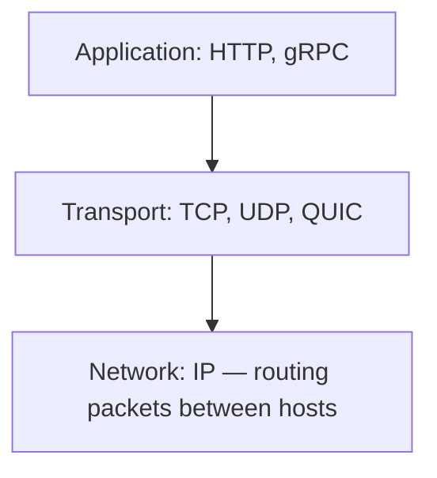
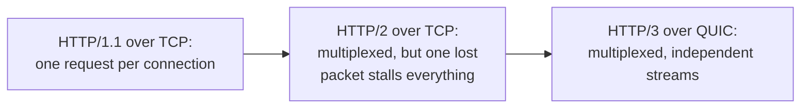

The protocol layers underneath every API call, from the transport
guarantees TCP provides up through the HTTP version actually carrying
the request. This is the "what is actually happening on the wire"
layer — for choosing an API *style* on top of it, see
[APIs: REST vs. GraphQL vs. gRPC](/guides/apis-rest-vs-graphql-vs-grpc).

## The layers, briefly

Each layer solves a different problem: the network layer gets a packet
from one host to another; the transport layer decides what guarantees
that delivery has (ordered? reliable? at what cost?); the application
layer defines the actual message format two programs agree to speak.

## Transport: TCP vs. UDP vs. QUIC

- **TCP** — connection-oriented: a handshake establishes the connection
  before any data flows, and every byte is acknowledged, retransmitted
  on loss, and delivered in order. That reliability costs latency (the
  handshake, and retransmission stalls) and is why almost all
  request/response traffic (HTTP included) has historically run on it.
- **UDP** — connectionless: packets are fired off with no handshake, no
  ordering guarantee, and no automatic retransmission. Lower latency and
  overhead, at the cost of the application having to handle loss and
  reordering itself if it cares — the right tradeoff for things where a
  late or missing packet is worse than a dropped one (live video, DNS
  lookups, real-time gaming).
- **QUIC** — built on UDP, but adds TCP-like reliability *and* built-in
  TLS encryption, negotiated in a single round trip instead of TCP's
  handshake followed by a separate TLS handshake. It also solves a
  specific TCP problem: **head-of-line blocking** — in TCP, one lost
  packet stalls every stream sharing that connection until it's
  retransmitted, even for data unrelated to the lost packet; QUIC
  multiplexes independent streams so one stream's loss doesn't stall the
  others. This is the transport HTTP/3 runs on.

## HTTP/1.1 vs. HTTP/2 vs. HTTP/3

- **HTTP/1.1** — one request per connection at a time (browsers work
  around this by opening several connections in parallel, which has its
  own overhead — each one pays a fresh TCP+TLS handshake).
  Human-readable text format.
  
- **HTTP/2** — multiplexes many requests over a *single* TCP connection
  (no more opening six connections to load six assets), plus header
  compression and server push. Because it's still built on TCP, though,
  a single lost packet stalls every multiplexed stream on that
  connection — TCP-level head-of-line blocking, one layer up from where
  HTTP/2 tried to solve it.

- **HTTP/3** — the same multiplexing model as HTTP/2, but running over
  QUIC instead of TCP, which is what actually removes the head-of-line
  blocking problem: one stream's packet loss no longer stalls the
  others, because QUIC's stream independence is enforced at the
  transport layer, not layered on top of it.

## Where to go from here

Once a connection model is chosen, the next questions are usually how
traffic gets distributed across servers
([Networking: Load Balancing](/guides/networking-load-balancing)) and,
for anything that needs the server to push data rather than wait for a
request, [Networking: Real-Time Communication](/guides/networking-real-time-communication).
