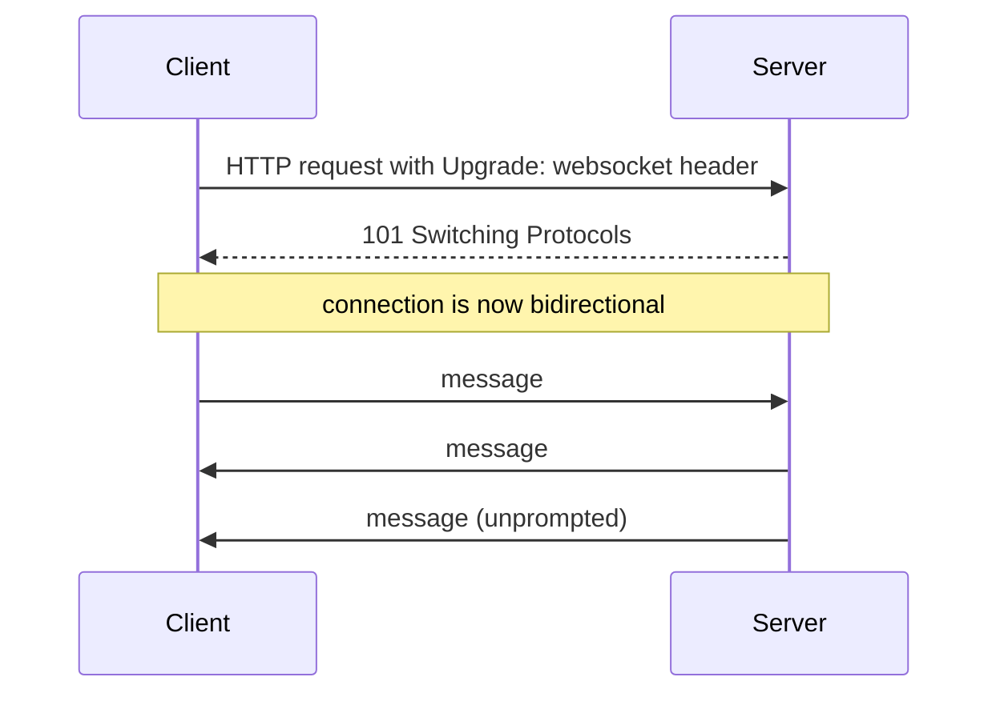
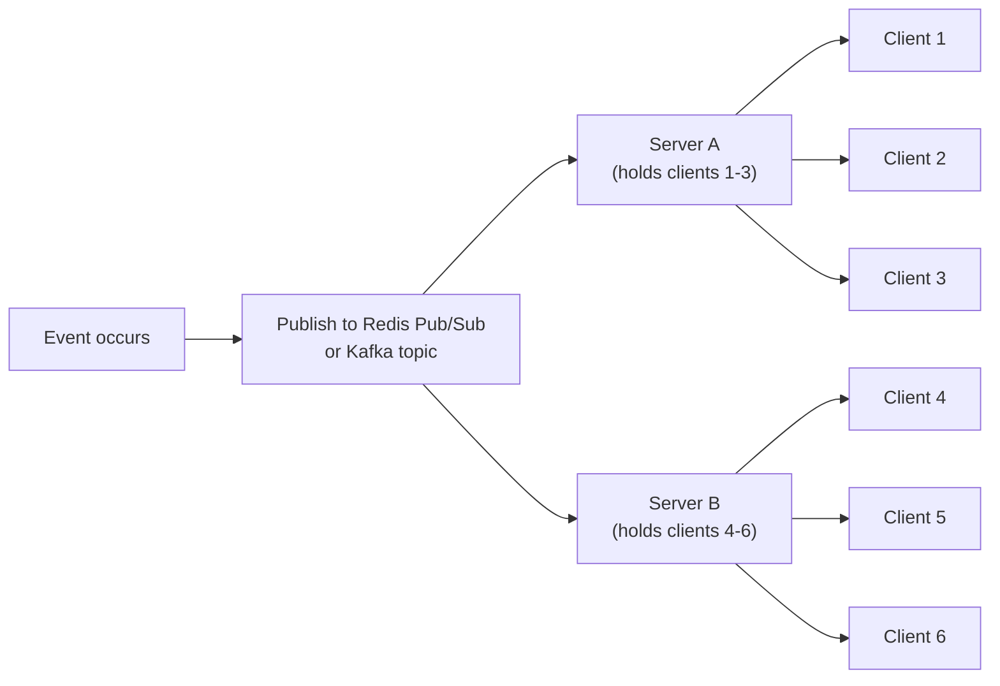

Plain request/response HTTP assumes the client always speaks first.
Anything that needs the *server* to push data the instant it's
available (a chat message, a live score, a notification) needs a
different mechanism. This guide covers the options and how they scale;
for the underlying transport differences (TCP vs. QUIC) they build on,
see [Networking: Protocols](/guides/networking-protocols).

## Long polling

The client makes a request and the server simply **holds it open**
without responding until there's actually something to send (or a
timeout is hit), then the client immediately opens a new request. It
works over plain HTTP with no special client support, but each open
connection ties up server resources for as long as it's held, and there's
still a gap (the time to open the next request) after each response.

## Server-Sent Events (SSE)

A single long-lived HTTP connection over which the **server** streams a
sequence of text events to the client, one-directional:

```
event: order-update
data: {"orderId": 42, "status": "shipped"}

event: order-update
data: {"orderId": 42, "status": "delivered"}
```

Built on plain HTTP (no special protocol upgrade), with automatic
reconnection handled by the browser's `EventSource` API. The one-way
limitation is also its strength for this use case: if the client never
needs to send anything back over the same connection (status updates,
live feeds, notifications), SSE is simpler than WebSockets and gets
HTTP/2 multiplexing for free.

## WebSockets

A protocol upgrade from an initial HTTP request into a persistent,
**bidirectional** connection: either side can send a message at any
time, not just in response to the other. The right choice when the
client genuinely needs to send data back over the same live connection,
not just receive it (a chat app, collaborative editing, multiplayer
game state).



The cost is state: unlike a stateless HTTP request, a WebSocket
connection lives on one specific server for its whole lifetime, which
complicates horizontal scaling (see fan-out, below) and means a server
restart drops every connection it's holding, not just in-flight
requests.

## WebRTC

Peer-to-peer: once a connection is established (via a signaling
server that helps two peers find and negotiate with each other, and
usually a STUN/TURN server to work around NAT), data flows **directly**
between clients, not through the application server at all. Built for
low-latency media (video/audio calls, real-time collaboration where
the round trip through a central server would add unacceptable delay),
at the cost of significantly more connection-setup complexity than
either SSE or WebSockets, and no server in the loop to easily persist
or audit what was sent.

## Fan-out at scale

A single server can hold a bounded number of concurrent long-lived
connections (SSE or WebSocket), and protocol choice has surprisingly
little to do with how far this scales. The actual constraint is
**fan-out**: when an event happens, how does it reach every connected
client that cares, when those clients' connections are spread across
many server instances?



Each server instance subscribes to a shared pub/sub layer (Redis
Pub/Sub, Kafka) rather than trying to track every other server's
connections directly: when an event occurs, it's published once, and
every server instance forwards it only to the clients actually
connected to *that* instance. This is also why sticky sessions or a
connection registry (which server holds which client) matter here in a
way they don't for stateless HTTP requests.

## Choosing

| | Direction | Best fit |
| --- | --- | --- |
| Long polling | Server → client (simulated) | Broadest compatibility, lowest implementation complexity |
| SSE | Server → client only | Live feeds, notifications, status updates |
| WebSockets | Bidirectional | Chat, collaborative editing, anything needing client → server too |
| WebRTC | Peer-to-peer | Low-latency media, when routing through a server adds unacceptable delay |

## Where to go from here

Holding open connections is only half the problem: reliably getting an
event to the right server instance to push in the first place is a
messaging problem; see [Kafka](/guides/kafka) or [Redis](/guides/redis)
for the pub/sub layer this fan-out typically runs on.
