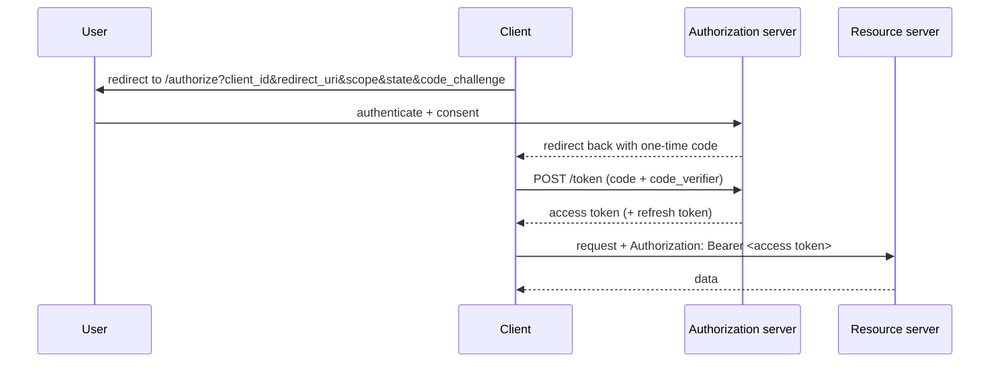

## The problem it solves

You want to let a third-party app read your Google Calendar. Handing it
your Google password would give it _everything_, forever, with no way to
take the access back short of a password reset.

OAuth 2.0 is the protocol that fixes this: the app gets a **limited,
revocable access token** — scoped to "read calendar", expiring in an hour —
and never sees your password. It's _delegated authorization_.

## The four roles

- **Resource owner** — you, the user who owns the data.
- **Client** — the app that wants access.
- **Authorization server** — issues tokens after authenticating you and
  getting your consent (Google's OAuth service).
- **Resource server** — the API holding the data, which accepts the token
  (the Calendar API).

## The Authorization Code flow

This is the flow to use for web and mobile apps. With PKCE (below) it's the
current best practice for essentially every client type.

1. The client redirects the user to the authorization server's
   `/authorize` endpoint with its `client_id`, a `redirect_uri`, the
   `scope` it wants, a random `state`, and a PKCE `code_challenge`.
2. The user authenticates and approves the requested scopes.
3. The authorization server redirects back to `redirect_uri` with a
   short-lived, single-use **authorization code**.
4. The client exchanges that code — plus the PKCE `code_verifier` — at the
   `/token` endpoint for an **access token** (and usually a refresh token).
5. The client calls the resource server with
   `Authorization: Bearer <access token>`.

**Why the extra code step?** The access token is returned on a
back-channel `POST`, never in a browser URL where it would leak into
history, logs, and `Referer` headers.

**PKCE** (Proof Key for Code Exchange) ties the code to the client that
started the flow: the client sends `code_challenge = hash(code_verifier)`
up front and the raw `code_verifier` at exchange time, so a stolen
authorization code is useless to anyone else. Public clients (SPAs, mobile)
have no client secret, so PKCE is what secures them — and it's now
recommended for confidential clients too.

**`state`** is a random value the client generates and checks on return —
[CSRF](/nuggets/csrf) protection for the redirect itself.

## Tokens and scopes

- **Access token** — short-lived (minutes to an hour), scoped, sent to the
  resource server on every call. May be opaque or a [JWT](/nuggets/jwt).
- **Refresh token** — long-lived, used against the token endpoint to get a
  new access token without sending the user back through consent. Store it
  server-side or in secure device storage; rotate it on each use.
- **Scopes** — the space-separated permission strings (`calendar.read`).
  Request the minimum you need; more scopes means a scarier consent screen
  and a bigger blast radius if the token leaks.

## Other grant types

- **Client credentials** — no user involved; a service authenticates as
  itself for machine-to-machine access.
- **Device code** — for input-constrained devices (TVs, CLIs): the user
  visits a URL on their phone and enters a code.
- **Deprecated — don't use:** the _implicit_ flow (access token returned
  directly in the URL fragment) and _resource owner password credentials_
  (the app collects the user's password). Both are disallowed by the OAuth
  2.1 guidance; use authorization code + PKCE instead.

## OpenID Connect: authentication on top

OAuth 2.0 answers "what may this app do" — authorization. It deliberately
says nothing about "who is this user". OpenID Connect (OIDC) is a thin
layer that adds authentication:

- an **ID token** — a JWT with verified identity claims (`sub`, `email`,
  `name`, issuer, audience) that the client validates directly;
- a `/userinfo` endpoint;
- the `openid` scope that triggers all of it.

"Log in with Google / Apple / Okta" is OIDC. If you need to know who the
user is, use the ID token — not the access token.

## Common mistakes

- Treating the **access token as proof of identity**. It's a capability,
  not an ID. Inspecting or trusting its contents for "who is this" is the
  bug OIDC's ID token exists to prevent.
- Not validating **`state`** on the redirect.
- Skipping **PKCE**, or putting a **client secret in a SPA** (there's no
  way to keep it secret in the browser).
- **Long-lived access tokens** — lean on refresh tokens and keep access
  tokens short so revocation actually bites.

## Where it fits

OAuth/OIDC is the standard answer whenever a _third party_ needs access, or
whenever you want federated "log in with…" rather than running your own
password database. For first-party auth between your own frontend and your
own backend, the lighter-weight options in
[Session vs. Token Authentication](/nuggets/session-vs-token-auth) are
often enough. Either way, the token-handling rules in
[APIs: Best Practices](/guides/api-best-practices) still apply.
