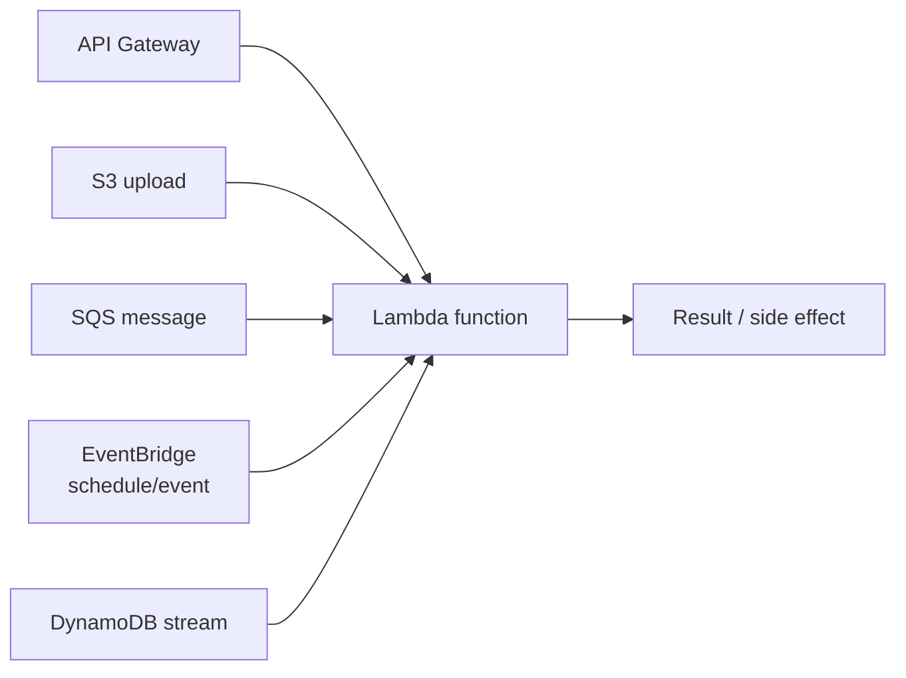

Serverless compute (AWS Lambda is the flagship example, and what most
people mean when they say "serverless") runs your code in response to
an event and bills only for the time it actually executes, with no
server to provision, patch, or keep running between invocations.

## The execution model

A Lambda function is stateless and ephemeral by design: it's invoked,
runs, returns a result, and its execution environment may or may not
still exist the next time it's invoked. Nothing written to local state
is guaranteed to survive between invocations (the `/tmp` directory
persists only for as long as that specific environment happens to stay
warm — not something to rely on).

Almost anything can trigger one — an HTTP request via
[API Gateway](/guides/api-gateway), a file landing in
[blob storage](/guides/blob-storage), a message on a queue, a scheduled
event, a database change stream. This is what makes serverless a
natural fit for event-driven architectures: the function is just the
"what happens when X occurs" piece, with no idle capacity sitting
around waiting for X.

## Cold starts, and how they're actually mitigated in 2026

A **cold start** is the latency penalty of provisioning a fresh
execution environment (downloading the code, starting the runtime,
running any module-level initialization) before your handler code
even begins. A **warm** invocation skips all of that and just runs the
handler directly, which is why identical requests can have wildly
different latency depending on whether an existing environment was
available to reuse.

Current mitigations, in order of how commonly they're reached for:

- **Graviton (ARM64)** — AWS's own Arm-based processors cut cold start
  latency by roughly 45-65% across runtimes compared to x86, are up to
  ~19% faster overall, and cost about 20% less. There's rarely a reason
  not to build for `arm64` unless a dependency genuinely requires x86.
- **Provisioned Concurrency** — pay to keep a set number of execution
  environments pre-initialized and warm at all times, so those
  invocations never pay the cold-start cost at all. The right tool for
  a latency-sensitive path with predictable traffic; wasteful for
  bursty, unpredictable traffic since you're paying for idle capacity.
- **SnapStart** (Java, Python, and .NET) — takes a snapshot of an
  initialized execution environment and resumes from it instead of
  booting from scratch, removing an estimated 70-90% of init latency
  for the runtimes it supports.

One easy-to-miss cost detail: **as of August 2025, AWS bills for the
initialization phase of a cold start**, not just handler execution time.
That's worth knowing if you're estimating cost from an older
understanding of Lambda's pricing model, especially for
initialization-heavy runtimes like Java or C#.

## Quotas that shape real designs

| Quota | Value |
| --- | --- |
| Memory | 128 MB – 10,240 MB |
| CPU | Scales with memory; 1 full vCPU at ~1,769 MB |
| Timeout | 900 seconds (15 minutes) — a hard limit, not raisable |
| Default concurrency | 1,000 executions account-wide (raisable via a quota request) |

The timeout being a hard limit matters more than it looks: a Lambda
invoked directly can run the full 15 minutes, but one invoked *through*
[API Gateway](/guides/api-gateway) inherits API Gateway's own separate
29-second hard timeout. A request that would otherwise finish in 3
minutes gets cut off at 29 seconds regardless of Lambda's own limit.
Anything that can genuinely run long needs the same pattern as
[Managing Long-Running Tasks](/nuggets/long-running-tasks): return
immediately with a job id, do the work asynchronously (a Lambda
triggered by a queue rather than a synchronous API call), and let the
client poll or get notified.

## Retries make idempotency non-optional

Asynchronous Lambda invocations (triggered by S3, SNS, EventBridge)
**retry automatically on failure** by default: a transient error in
your function can mean AWS invokes it again with the same event, with
no code on your part requesting that retry. This makes
[idempotency](/nuggets/idempotency) a hard requirement for serverless
handlers, not a nice-to-have: any function that isn't safe to run twice
on the same input will eventually run twice on the same input.

## The database connection problem

A traditional relational database has a fixed, small connection limit.
Lambda can scale from zero to hundreds of concurrent execution
environments in seconds, and if each one opens its own database
connection, a burst in traffic can exhaust the database's connection
limit before the burst even finishes. The standard fix is **RDS
Proxy** (or an equivalent connection-pooling layer) sitting between
Lambda and the database, pooling and reusing connections instead of
each invocation opening a fresh one — or reaching for a database with a
connection model designed for this (DynamoDB, Aurora Serverless) rather
than fighting a traditional one.

## Serverless vs. containers

- **Serverless (Lambda)** fits bursty or unpredictable traffic well:
  you pay per invocation, and scale-to-zero means no cost when nothing's
  happening. It fits poorly for steady, high-throughput workloads,
  where per-invocation overhead and cold starts add up to worse
  economics than a container that's already warm and handling a
  constant stream.
- **Containers** (see [Docker: Getting Started](/guides/docker-getting-started))
  fit steady workloads and anything needing more control over the
  runtime environment, long-lived connections, or execution beyond 15
  minutes — at the cost of paying for capacity whether or not it's
  currently in use.

AWS Fargate sits in between: containers, but billed and scaled more
like serverless (no server to manage). Worth knowing as the answer to
"I want container flexibility without giving up the scale-to-zero
economics."

## Where it applies

Event-driven glue code (resize an image on upload, process a queue
message), APIs with bursty or unpredictable traffic, scheduled jobs,
and anything where paying for idle capacity is the actual problem being
solved. Less of a fit for steady high-throughput services, anything
needing a long-lived connection or in-memory state across requests, or
executions that routinely approach the 15-minute ceiling.

## The real tradeoff

Serverless relocates operational complexity rather than eliminating
it: you stop managing servers and start managing cold starts, retry
semantics, connection exhaustion, and a hard timeout ceiling instead.
It's a genuinely good trade for the right workload shape (bursty,
event-driven, stateless), and a source of surprising failure modes for
the wrong one (steady, connection-heavy, long-running).
