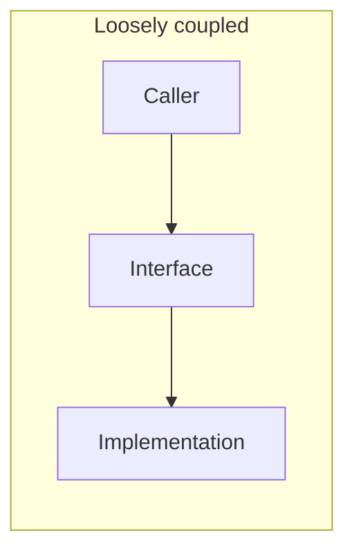
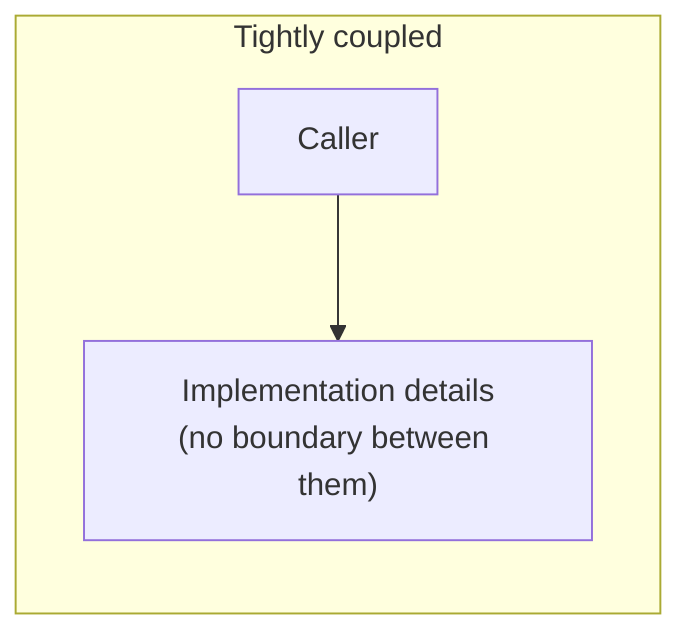

## What it is

**Abstraction** hides implementation details behind a simpler interface —
the caller depends on _what_ something does, not _how_. **Coupling** is
how much one part of a system depends on another's specific details.
They're related but not simple opposites: a _good_ abstraction reduces
coupling, but a leaky or badly-placed one can add layers of indirection
while the real coupling slips through underneath anyway.





## Example

```python
# Tightly coupled — OrderService is locked to SMTP specifically. Switching
# email providers, or testing without sending real email, means changing
# OrderService itself.
class OrderService:
    def __init__(self):
        self.mailer = SmtpMailer("smtp.example.com")

    def complete_order(self, order):
        self.mailer.send(order.customer_email, "Order confirmed")

# Decoupled via an abstraction — OrderService depends on the Mailer
# interface, not a specific implementation. Any Mailer works, including a
# fake one in tests.
class OrderService:
    def __init__(self, mailer: Mailer):
        self.mailer = mailer

    def complete_order(self, order):
        self.mailer.send(order.customer_email, "Order confirmed")
```

## Why it matters

The point of an abstraction is to let the implementation behind it change
without the caller needing to change too. That only works if the boundary
is drawn in the right place — at something that genuinely varies or needs
to be swappable. Draw it somewhere that doesn't actually vary, and you've
added a layer of indirection that buys nothing.

**Leaky abstractions** are the more common failure: the interface _looks_
like it hides the implementation, but callers end up depending on its
incidental behavior anyway. An ORM is the classic example — it abstracts
away writing SQL by hand, but a caller who doesn't understand what query
it actually generates can easily write code that triggers the
[N+1 query problem](/nuggets/n-plus-one-queries). The abstraction didn't
remove the coupling to the database's real behavior; it just hid it well
enough to make it easy to trip over.

## Premature abstraction

The opposite mistake is drawing a boundary before there's a second real
use case to justify it — an interface with exactly one implementation,
guessed at in advance. It adds indirection (another layer to read through,
another place a bug can hide) without buying any actual decoupling, since
there's nothing real being decoupled from yet. This is the same shape of
mistake as premature optimization: solving a flexibility problem you don't
have yet, at a real cost paid today.

## Where it applies

Interface and API design, module boundaries, and code review — a common
coupling smell is a caller reaching _through_ an abstraction to touch the
implementation's internals directly (a "leaky" import, a cast, a
documented-as-private field used anyway), which is a sign the abstraction
isn't actually where the real boundary needs to be.

## Where to draw the line

Place the boundary where change actually happens, not wherever adds the
most layers or removes the most direct calls — abstraction and coupling
are means, not scores to optimize for their own sake. A good abstraction
sits at a genuine seam and earns its indirection; a bad one is just extra
ceremony wrapped around the same underlying coupling, which still shows up
the moment something on the other side changes.
