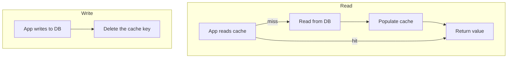

## What it is

Techniques for keeping a cache from serving stale data once the
underlying data changes. The three common strategies are **TTL**
(time-based expiry), **cache-aside** (the app reads through the cache and
explicitly invalidates on write), and **write-through** (writes go to the
cache and the database together). For the question of _whether_ and _how
stale_ a given piece of data is allowed to be in the first place, see
[Cache vs. Freshness](/nuggets/cache-vs-freshness). This nugget is about
the mechanics of keeping a cache correct once you've decided to use one.

## Why it matters

> "There are only two hard things in Computer Science: cache invalidation
> and naming things." — Phil Karlton

Caching itself is easy: store a value, return it next time. Keeping that
value correct once the source of truth changes is the actual hard part,
and getting it wrong means serving stale data silently, which is much
worse than serving no cache at all.

## Cache-aside (lazy loading)



The app reads through the cache and populates it on a miss. On write, it
writes to the database, then **deletes** the cache key rather than
updating it: a delete-and-repopulate-on-next-read avoids a race where two
concurrent writes finish out of order and leave the cache holding the
_older_ write's value forever.

```python
def get_user(user_id):
    cached = cache.get(f"user:{user_id}")
    if cached is not None:
        return cached
    user = db.query("SELECT * FROM users WHERE id = ?", user_id)
    cache.set(f"user:{user_id}", user, ttl=300)
    return user

def update_user(user_id, changes):
    db.update("users", user_id, changes)
    cache.delete(f"user:{user_id}")  # not cache.set(...) — see above
```

## Write-through

Every write goes to the cache and the database together, as one path: the
cache is always current the instant a write happens. The cost is added
latency on every write, and a cold cache still needs a first-read fallback
(or pre-warming) for keys that have never been written since the cache
started.

## TTL as a backstop

Even with cache-aside or write-through, a short TTL is worth keeping as a
safety net: it bounds how long any missed invalidation (a bug, a write
that bypassed the normal path) can stay wrong.

## Where it applies

Anywhere a cache sits in front of a slower source of truth: Redis/Memcached
in front of a database, HTTP caching, CDNs in front of an origin server.

## Framing the design question

No strategy eliminates staleness completely; the real design question is
how much staleness is acceptable, and for how long. A cache is rarely
simply "correct" or "broken" — pick, or combine, strategies that keep
staleness within whatever bound the data actually needs.
