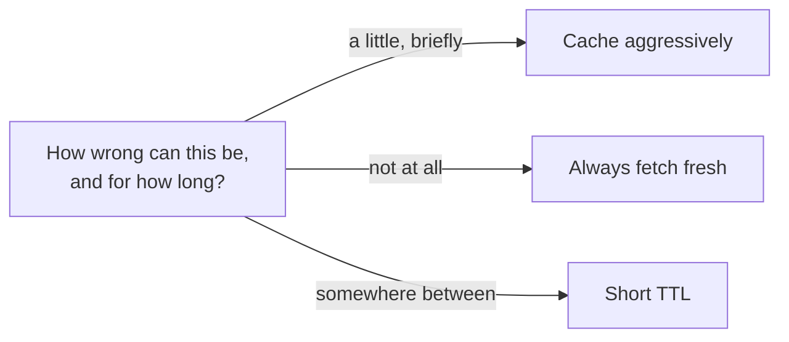

## What it is

Every cache makes the same trade: serve a stored answer quickly, or go get
the real, current answer slowly. **Cache** means fast, cheap, possibly
stale. **Freshness** means correct as of right now, at the cost of doing
the real work — a database query, an API call, a computation — every
single time.

## Why it matters

This is a decision to make deliberately per piece of data, not a single
global setting. Some data is expensive to compute and safe to serve
slightly stale — a product recommendation list, a dashboard's aggregate
stats, a page of mostly-static content. Other data is cheap to fetch fresh
and dangerous to serve stale — an account balance, whether a seat is still
available, a permission check. Caching the second kind for the sake of
speed can turn a performance win into a correctness bug.

## The dial: TTL

Time-to-live is the tuning knob between the two extremes — how long a
cached value is allowed to be served before it's considered stale and
refetched. A longer TTL means better performance and a bigger window where
readers might see outdated data; a shorter TTL means closer to fresh at the
cost of hitting the real source more often. There's rarely a single
correct TTL for a whole system — it should be set per piece of data, based
on how expensive it is to compute and how much staleness that particular
data can tolerate before it actually matters to whoever's reading it.

For the actual mechanics of keeping a cache correct as the underlying data
changes — cache-aside, write-through, invalidating on write — see
[Cache Invalidation](/nuggets/cache-invalidation).

## Where it applies

Every read path with a cache in front of a slower source: CDNs in front of
web content, an in-memory cache in front of a database, a client caching
an API response. Also shows up outside literal caches — a search index
that's rebuilt periodically instead of updated live is making the exact
same freshness-vs-cost trade.

## Key insight

"Should this be cached" is the wrong question — the real question is "how
stale can this be before it's actually wrong for the person reading it,"
and the answer is different for almost every piece of data in a system.
Caching everything the same way, with the same TTL, treats a page view
count and an account balance as if they had the same tolerance for being
wrong — they don't.
