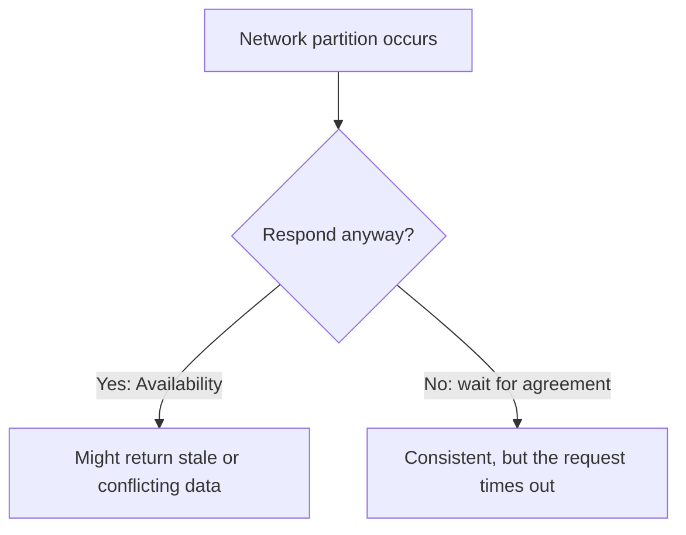

## What it is

The **CAP theorem**: in a distributed system, when a network partition
happens, you have to choose between **Consistency** (every read sees the
latest write) and **Availability** (every request gets a response). You
can't guarantee both at the same time.

## Why it matters

Network partitions aren't a rare edge case to design around later — packet
loss, a crashed node, a slow link between data centers, all happen
regularly at scale. CAP forces a decision about what your system does when
that happens, and it's much better to make that decision deliberately at
design time than to discover it during an incident.

## "Pick two of three" is a bit of a misnomer

CAP is often summarized as "pick 2 of C, A, P," as if **CA** (consistent
and available, but not partition-tolerant) were a real option. In practice
it isn't — any system distributed across more than one node will
eventually experience a partition, so partition tolerance isn't optional.
The real choice is what happens _during_ a partition: stay consistent and
refuse some requests (**CP**), or stay available and risk serving stale or
conflicting data (**AP**).

## Examples

- **CP**: systems built on consensus protocols (ZooKeeper, etcd) —
  they'd rather return an error than risk an inconsistent read.
- **AP**: Cassandra (in its default configuration), DNS — they keep
  serving during a partition and reconcile conflicting writes afterward.

## Where it applies

Choosing a database (a strongly consistent relational store vs. an
eventually consistent NoSQL store), and designing any service replicated
across multiple regions or availability zones.

## Key insight

CAP is specifically about behavior _during_ a partition — the rest of the
time, a well-designed system can be both consistent and available. It's a
tradeoff to choose deliberately up front, not a limitation to discover
under pressure mid-incident.
