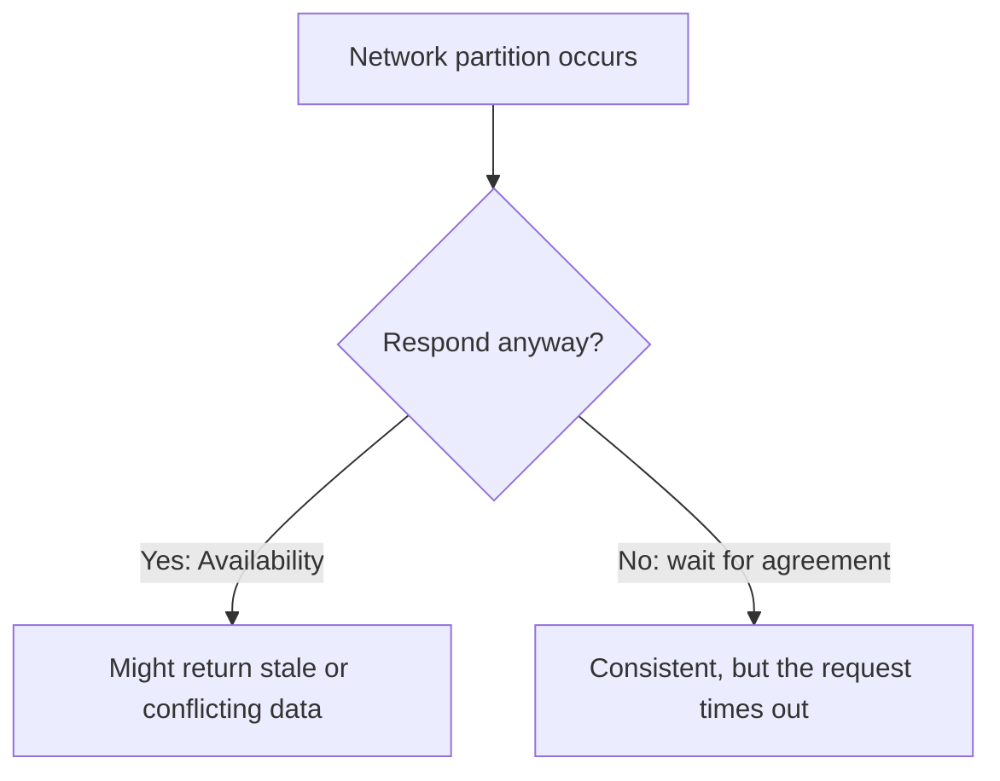
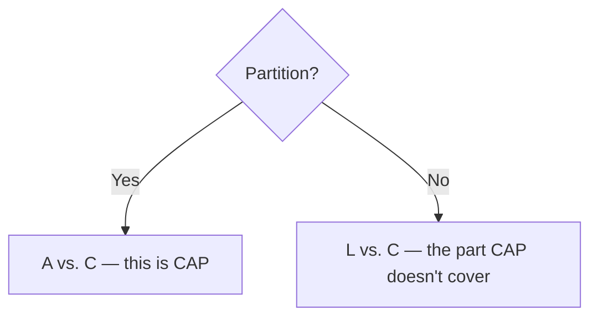

## What it is

The **CAP theorem**: in a distributed system, when a network partition
happens, you have to choose between **Consistency** (every read sees the
latest write) and **Availability** (every request gets a response). You
can't guarantee both at the same time.

## Why it matters

Network partitions aren't a rare edge case to design around later — packet
loss, a crashed node, a slow link between data centers, all happen
regularly at scale. CAP forces a decision about what your system does when
that happens, and it's much better to make that decision deliberately at
design time than to discover it during an incident.

## "Pick two of three" is a bit of a misnomer

CAP is often summarized as "pick 2 of C, A, P," as if **CA** (consistent
and available, but not partition-tolerant) were a real option. In practice
it isn't. Any system distributed across more than one node will
eventually experience a partition, so partition tolerance isn't optional.
The real choice is what happens _during_ a partition: stay consistent and
refuse some requests (**CP**), or stay available and risk serving stale or
conflicting data (**AP**).

## Examples

- **CP**: systems built on consensus protocols (ZooKeeper, etcd) —
  they'd rather return an error than risk an inconsistent read.
- **AP**: [Cassandra](/guides/dynamodb-and-cassandra) (in its default
  configuration), DNS — they keep serving during a partition and reconcile
  conflicting writes afterward.

## PACELC: the tradeoff CAP leaves out

CAP only describes behavior _during_ a partition: it says nothing about
the rest of the time, when the network is perfectly healthy. **PACELC**
extends it: **if Partition, choose Availability or Consistency (that's
CAP) — Else, choose Latency or Consistency.**

Even with a healthy network, a system that wants every read to see the
latest write has to synchronously confirm that write against enough
replicas before acknowledging it, which costs latency. A system that
acknowledges a write as soon as it hits one node, replicating to the
others asynchronously, is faster but a read against a different replica
immediately afterward can return stale data. That's a real tradeoff even
when there's no partition in sight.

This is why "AP" doesn't fully describe a system like DynamoDB or
Cassandra: they're **PA/EL** — available over consistent during a
partition, _and_ latency over consistency the rest of the time too, by
design (no synchronous cross-replica confirmation even when the network
is fine). A traditional single-leader relational database with
synchronous replication is closer to **PC/EC** — consistent both during
and outside a partition, paying the latency cost in both cases. Naming
just the partition behavior ("it's AP") is the incomplete half of the
answer an interviewer asking about CAP is usually listening for.

## Where it applies

Choosing a database ([a strongly consistent relational store vs. an
eventually consistent NoSQL store](/nuggets/sql-vs-nosql)), and designing
any service replicated across multiple regions or availability zones.

## Choose it deliberately

CAP is specifically about behavior _during_ a partition — the rest of the
time, a well-designed system can be both consistent and available in the
CAP sense, though PACELC shows it still trades latency for consistency
even then. Either way, it's a tradeoff to choose deliberately up front,
not a limitation to discover under pressure mid-incident.
