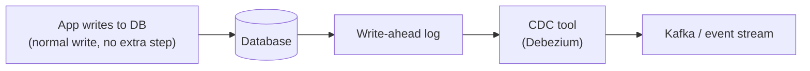

## What it is

**Change Data Capture (CDC)** reads a database's own internal change
log: the write-ahead log (WAL) in Postgres, the binlog in MySQL. It turns
each row-level insert, update, or delete into a stream of events, without
the application ever having to explicitly publish them.

## Why it matters

The alternative is dual-writing: the application writes to the
database, then separately publishes an event describing what changed.
That's exactly [the dual-write problem](/nuggets/outbox-pattern) — two
systems, no shared transaction, no atomic guarantee that both actually
happen. CDC sidesteps it differently than the outbox pattern does:
instead of writing the event and the data in one transaction and
relaying it, CDC never asks the application to publish anything at
all: it derives the event stream from changes that already,
unavoidably, happened in the database's log.

## CDC vs. the outbox pattern

Both solve reliable event publishing, but differently:

- **Outbox** requires an explicit outbox-table write in the same
  transaction as the business data: the application has to know to do
  it, but the event's shape is exactly whatever the app wrote.
- **CDC** requires zero application changes (any write is
  automatically captured), but the event is a raw row-level diff (this
  column changed from X to Y), which often needs transforming into a
  meaningful business event downstream, and it couples consumers to the
  database's physical schema.

## Where it applies

Replicating data into a search index or a cache without dual-writing to
both, feeding a data warehouse or lake from an OLTP database without
batch ETL jobs, and building an audit log of every change without
touching application code. Debezium (built on Kafka Connect) is the
common open-source implementation across Postgres, MySQL, and MongoDB.

## Which one to reach for

CDC and the outbox pattern both exist to avoid the dual-write problem,
but from opposite ends: outbox makes the application explicit about
what to publish; CDC makes publishing automatic by reading what already
happened. Pick CDC when zero app-code involvement matters more than
schema coupling; pick outbox when control over the event's shape
matters more than the extra plumbing.
