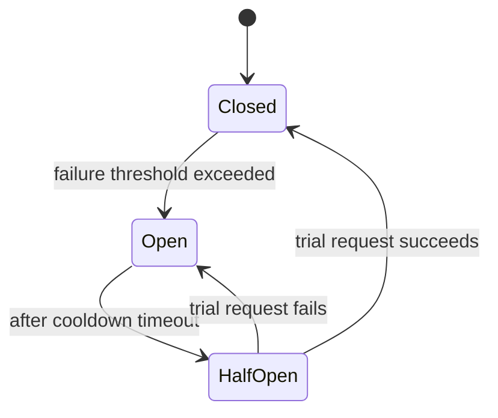

## What it is

A **circuit breaker**, named after the electrical version, stops a service
from repeatedly calling a downstream dependency that's already failing.
Instead of letting every request wait out a timeout against something
that's clearly down, it "trips" and fails fast for a cooldown period.

## The three states



- **Closed** — normal operation. Requests pass through to the dependency;
  failures are counted.
- **Open** — the failure threshold was hit. Requests fail immediately,
  without calling the dependency at all, for a cooldown period.
- **Half-Open** — after the cooldown, a small number of trial requests are
  let through. Success closes the breaker again; failure reopens it.

## Why it matters

Without a circuit breaker, a struggling dependency gets hit by every
caller retrying (possibly with [backoff](/nuggets/exponential-backoff),
but still hit), which can be exactly what prevents it from ever recovering.
Every caller also pays the cost of waiting out a full timeout on each
failed call, tying up threads/connections for something that was never
going to succeed.

Failing fast while the breaker is open avoids both problems: the
downstream service gets a chance to recover without added load, and
callers get an immediate, predictable failure instead of hanging on a
timeout.

## Example

```python
class CircuitBreaker:
    def __init__(self, failure_threshold=5, cooldown_seconds=30):
        self.failures = 0
        self.state = "closed"
        self.opened_at = None
        self.failure_threshold = failure_threshold
        self.cooldown_seconds = cooldown_seconds

    def call(self, fn):
        if self.state == "open":
            if time.time() - self.opened_at < self.cooldown_seconds:
                raise CircuitOpenError()
            self.state = "half-open"

        try:
            result = fn()
        except Exception:
            self.failures += 1
            if self.state == "half-open" or self.failures >= self.failure_threshold:
                self.state = "open"
                self.opened_at = time.time()
            raise
        else:
            self.failures = 0
            self.state = "closed"
            return result
```

## Common uses

Service-to-service calls in a microservice architecture (Netflix's Hystrix
popularized the pattern), database connection pools, and any call to an
external dependency that can degrade under load.

## Backoff vs. circuit breakers

Backoff and circuit breakers solve complementary problems: backoff helps a
_caller_ survive a transient failure by spacing out its own retries; a
circuit breaker protects the _callee_ from being overwhelmed by every
caller's retries at once. Real systems generally need both.
