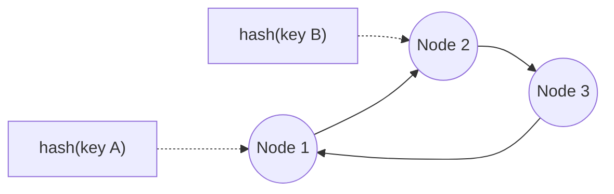

## What it is

A hashing scheme for distributing keys across a set of nodes (cache
servers, database shards) such that adding or removing a node only
requires remapping a small fraction of the keys, not all of them.

## Why it matters

The naive approach is `node = hash(key) % number_of_nodes`. It works, but
the moment the node count changes (a server added, one crashes) the
modulo result changes for almost every key at once. Nearly the entire
dataset needs to move or re-cache in one go, often at exactly the worst
time: right after a node has just failed and the system is already under
stress.

## How it works, briefly

Both nodes and keys are hashed onto the same fixed circular range: a
"ring." A key belongs to whichever node comes first going clockwise from
the key's position on the ring.

Adding or removing a node only affects the keys between it and its
neighbor on the ring. Everything else stays exactly where it was.

## Virtual nodes

In practice, each physical node is hashed onto multiple points on the
ring ("virtual nodes"), so load balances evenly even with a small number
of physical nodes. Without this, a physical node could end up owning a
disproportionately large or small arc of the ring purely by chance.

## Where it applies

Distributed caches (client-side hashing for Memcached), distributed
databases and sharding (Cassandra, DynamoDB), and load balancers
distributing sticky sessions across backend instances.

## Why this beats the naive approach

That's the entire benefit over `hash(key) % n`: adding or removing a node
becomes a small, local, proportional change instead of a full-dataset
reshuffle, which is what makes horizontally scaling a cache or a shard set
an ordinary operation instead of a scheduled-maintenance event.
