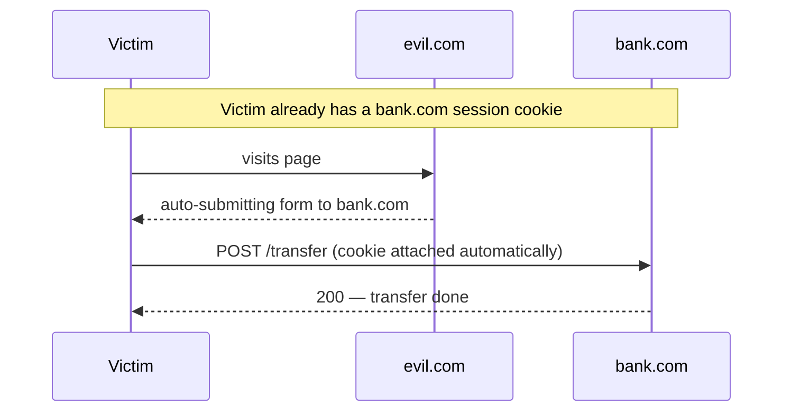

## What it is

Cross-site request forgery (CSRF): the browser automatically attaches a
site's cookies to _every_ request to that site — including requests
triggered by a different site. So a page on `evil.com` can quietly cause
the victim's browser to send an authenticated request to `bank.com`.

```html
<!-- on evil.com; submits itself as soon as the page loads -->
<form action="https://bank.com/transfer" method="POST">
  <input type="hidden" name="to" value="attacker" />
  <input type="hidden" name="amount" value="5000" />
</form>
<script>
  document.forms[0].submit();
</script>
```

The victim is logged into `bank.com`, so the session cookie goes along and
the transfer is fully authenticated. The victim never sees it happen.



## Why it matters

The forged request is state-changing and perfectly authenticated — the
server has no built-in way to tell it apart from one the user intended.
Anything a logged-in user can do with a simple request (transfer money,
change their email, delete an account) an attacker can trigger from an
unrelated page.

## The fixes

- **`SameSite` cookies** — `SameSite=Lax` (the modern browser default) or
  `Strict` tells the browser not to send the cookie on cross-site
  requests. This alone neutralizes most CSRF; don't rely on the default
  being set for you, set it explicitly.
- **CSRF tokens** — a per-session, unguessable value rendered into your
  forms and required on every state-changing request. The
  [same-origin policy](/guides/networking-protocols) stops `evil.com` from
  reading it, so it can't forge a valid request. (Synchronizer-token or
  double-submit-cookie pattern.)
- **Check `Origin` / `Referer`** on unsafe methods as a secondary signal.
- **Non-automatic credentials** — auth sent in an `Authorization` header
  instead of a cookie isn't attached by the browser automatically, so it's
  immune to CSRF (see [Session vs. Token Authentication](/nuggets/session-vs-token-auth)).

## Where it applies

Any endpoint that (a) authenticates via cookies and (b) changes state.
Safe methods should stay safe: a `GET` that mutates data is both an
[idempotency](/nuggets/idempotency) bug and a CSRF hole, because it can be
triggered with a bare `` tag.

## The actual rule

CSRF is an _ambient authority_ problem — the credential travels with the
request whether or not the user meant to send it, so intent has to be
proven separately (a token the attacker can't obtain, or a cookie the
browser won't send cross-site). Header-based token auth sidesteps the whole
class by not being ambient in the first place.
