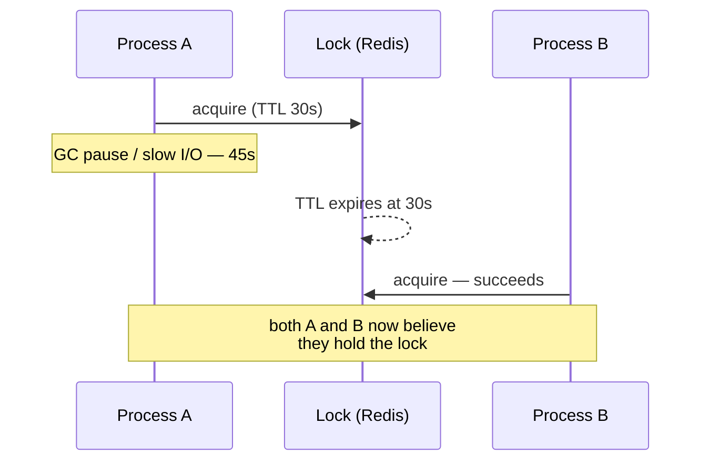

## What it is

A mechanism for ensuring only one process, across multiple machines,
can hold a given lock at a time — the multi-process equivalent of a
mutex, needed whenever
[pessimistic locking](/nuggets/optimistic-vs-pessimistic-locking) has
to work across services that don't share a database or a single
process's memory.

## The basic mechanism

```
SET lock:invoice-42 <unique-token> NX EX 30
```

`NX` ("set if not exists") makes acquisition atomic — only the first
caller succeeds; `EX 30` gives the lock a TTL so it's automatically
released if the holder crashes before explicitly unlocking it.
Releasing checks the token matches before deleting, so a process can't
accidentally release a lock it doesn't actually hold anymore (e.g.
after its own lock already expired and someone else acquired it).

## The gotcha: the TTL can expire mid-work



A long GC pause, a slow disk, or just underestimating how long the work
takes can make a process run longer than the lock's TTL — the lock
expires while the original holder is still working, a second process
acquires it, and now two processes believe they exclusively hold it.
This isn't a rare edge case; it's the central hard problem with
distributed locks.

## Fencing tokens

The fix isn't a longer TTL (that just delays the same problem) — it's
giving every acquisition a monotonically increasing **fencing token**,
and having the *protected resource itself* reject any write from a
stale token:

```
if incoming_token < resource.highest_seen_token:
    reject()  # this holder's lock had already expired
resource.highest_seen_token = incoming_token
apply(write)
```

This moves the actual safety check to the resource being protected,
rather than trusting that lock possession alone means exclusivity —
which is the only fully correct fix, not a workaround.

## Where it applies

Coordinating exclusive access across services: only one instance of a
scheduled job running at once, preventing two workers from processing
the same queue item, leader election. Redis (via `SET NX EX`, or the
multi-node Redlock algorithm) and ZooKeeper/etcd (via their own
consensus-backed primitives) are the common implementations.

## Key insight

A distributed lock without fencing tokens only prevents concurrent
*acquisition* — it doesn't actually prevent concurrent *access* once a
TTL can expire mid-operation. Treat lock possession as advisory unless
the protected resource itself can reject stale writes.
