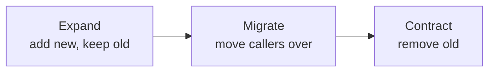

## What it is

**Expand-Contract** (aka _parallel change_) is a technique for making a
backwards-incompatible change (to a database schema, an API, a function
signature) without one risky, all-at-once cutover. Instead of changing
something in place, you move through three phases:

1. **Expand** — add the new thing alongside the old thing. Both work at once.
2. **Migrate** — move callers/data over to the new thing, one at a time,
   while the old thing still works as a fallback.
3. **Contract** — once nothing depends on the old thing anymore, remove it.



## Why it matters

Changing the shape of something in one atomic step forces every caller to
update in lockstep. That's fine for a single codebase deployed all at once,
but falls apart the moment more than one thing depends on the old shape:
multiple services, a live database with in-flight rows, mobile clients on
old app versions. Expand-contract decouples "ship the new capability" from
"finish the migration," so each step is small, reversible, and
independently deployable.

## Example: renaming a database column

Say `users.name` needs to become `users.full_name`.

**1. Expand** — add the new column, write to both:

```sql
ALTER TABLE users ADD COLUMN full_name TEXT;
```

```python
def save_user(user, input_name):
    user.name = input_name       # old
    user.full_name = input_name  # new — write both during the transition
    db.save(user)
```

**2. Migrate** — backfill existing rows, then flip readers over to the new
column one at a time:

```sql
UPDATE users SET full_name = name WHERE full_name IS NULL;
```

**3. Contract** — once every reader uses `full_name`, stop writing `name`
and drop it:

```sql
ALTER TABLE users DROP COLUMN name;
```

## Where else it applies

- **APIs** — add a new field/endpoint, deprecate the old one once clients
  have migrated, remove it in a later release (the removal is the
  [MAJOR version bump](/nuggets/semantic-versioning)).
- **Function signatures** — add a new parameter with a default, migrate
  call sites, then remove the old parameter.
- **Feature flags** — often used to control which phase of the migration is
  active for a given deployment.

## What makes it safe

The pattern trades one risky change for three small, reversible ones. At
any point before "contract," you can pause or roll back without breaking
anything: the old path still works. Safety comes from _never being in a
state where only the new thing works_, until it's been proven under real
usage.
