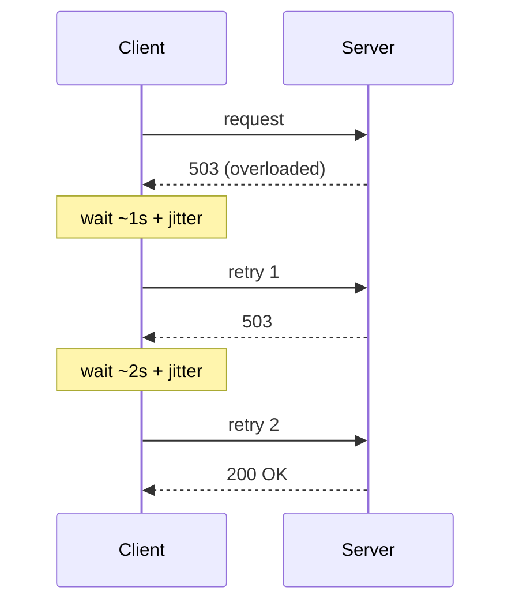

## What it is

**Exponential backoff** is a retry strategy where the wait time between
retries grows exponentially — `base * 2^attempt` — instead of retrying
immediately or waiting a fixed interval. **Jitter** adds randomness to that
wait time so retries from many clients don't land in sync.

## Why it matters

Retrying immediately after a failure just recreates the condition that
caused it — if a server is overloaded, a client hammering it with instant
retries only makes that worse. Spacing retries out exponentially gives the
failing system room to recover instead of getting hit again a millisecond
later.

Backoff alone isn't enough, though: if every client computes the same delay
sequence, they all back off _in lockstep_. A thousand clients that all
failed at once will all retry again at exactly the same moment — a
synchronized retry storm that can look just as bad as no backoff at all.
Jitter breaks that synchronization by adding randomness to the delay.



## Example: full jitter

"Full jitter" — picking a random delay between 0 and the exponential cap,
rather than the exponential value plus a small random offset — tends to
spread retries out the most evenly:

```python
import random

def backoff_delay(attempt, base=1.0, cap=30.0):
    exponential = min(cap, base * (2 ** attempt))
    return random.uniform(0, exponential)
```

## Where it applies

- HTTP client retry logic (most SDKs — AWS, Stripe, etc. — implement this
  by default for retryable errors).
- Message queue consumers redelivering failed messages.
- Anywhere a client might retry a request against a shared, possibly
  struggling dependency — which is most distributed systems. Because
  retries assume it's _safe_ to retry, this pairs directly with
  [idempotency](/nuggets/idempotency): backoff decides _when_ to retry,
  idempotency is what makes the retry safe to send at all.

## Key insight

Backoff protects the failing system from being retried too aggressively by
any one client. Jitter protects it from being retried in a synchronized
wave by _all_ clients at once. They solve two different problems and are
almost always used together.
