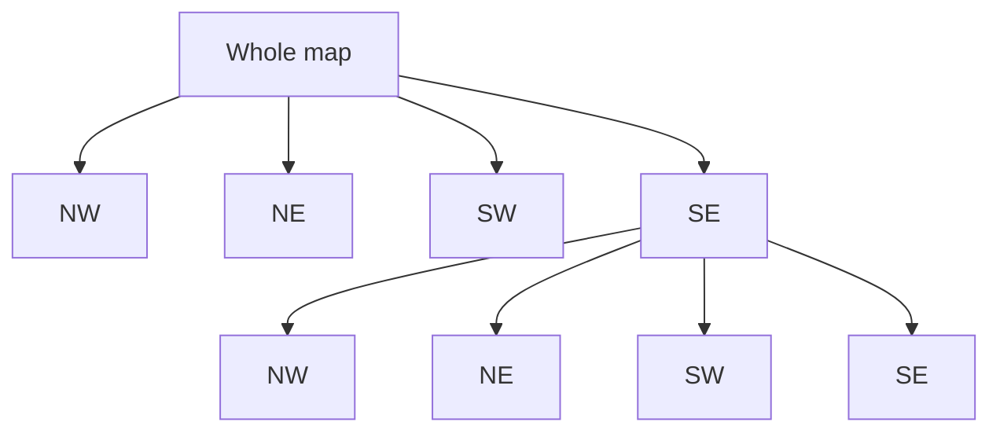

## What it is

Finding entities "near" a given location — nearby drivers, restaurants
within a mile — efficiently, rather than checking the distance to every
row in the database (which is `O(n)` and gets worse as the dataset
grows). Geospatial indexes convert 2D location into something a
standard index can search quickly.

## Geohashing

Geohashing encodes a (latitude, longitude) pair into a single string,
where **nearby locations tend to share a prefix** — the longer the
shared prefix, the closer the two points (with an important caveat
below). This turns "find things near me" into "find rows whose geohash
starts with this prefix," which a normal string index (or even a
B-tree) can serve directly.

```
geohash("40.7128, -74.0060")  → "dr5reg..."   (New York)
geohash("40.7300, -73.9950")  → "dr5ru3..."   (a mile away — shares "dr5r")
geohash("34.0522, -118.2437") → "9q5ctr..."   (Los Angeles — no shared prefix)
```

The caveat: geohash cells are rectangular, and two points can be
geographically close while falling just across a cell boundary —
sharing almost no prefix despite being near each other. Real
implementations search several neighboring prefixes, not just an exact
match, to compensate.

## Quadtrees

A quadtree recursively divides space into four quadrants, subdividing
further wherever data is dense — a sparse rural area stays one large
cell, a dense city block subdivides many times over. This adapts cell
size to actual data density, which flat geohashing (a fixed cell size
at a given precision) doesn't do on its own.



## Where it applies

Ride-sharing and delivery apps (nearest driver), local search
(restaurants within N miles), any "what's near this point" query at
scale. PostGIS (a Postgres extension) and Elasticsearch both ship
built-in geospatial indexing using these ideas; Uber's own H3 is a
newer hexagonal-grid alternative to geohashing's rectangles, avoiding
some of the boundary distortion.

## Key insight

The whole trick is turning a 2D "nearness" problem into a 1D indexable
value (a geohash string) or a space that's already partitioned by
density (a quadtree) — either way, avoiding a full scan-and-compute-
distance over every row is what makes proximity search at scale
possible at all.
