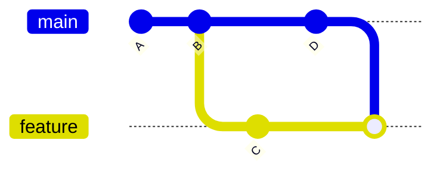

## What it is

Two different ways to bring one branch's changes into another. **Merge**
creates a new commit that ties the two histories together, preserving both
exactly as they happened. **Rebase** replays one branch's commits on top
of the other, rewriting them with new commit hashes, producing a linear
history, as if they'd been written on top of the latest code all along.

That's what a **merge** produces — both branches' commits stay exactly as
they were, tied together by a merge commit. A **rebase** of `feature` onto
`main` instead would produce a straight line (`A → B → D → C'`) where
`C'` is a brand-new commit with the same changes as `C`, but a different
hash, as if it had been written after `D` from the start.

## Why it matters

The choice affects both what your history looks like and how conflicts
get resolved. Merge preserves exactly what happened, including merge
commits that can clutter a log with noise. Rebase produces a clean,
linear, easy-to-read history. But it rewrites commit hashes, which is
dangerous on any branch other people have already pulled: their local
history now diverges from the rewritten one, and reconciling the two is
painful. This is the reasoning behind the rule "never rebase a branch
others have already based work on."

## Rule of thumb

- **Rebase** your own local, not-yet-shared feature branch onto the latest
  `main` before opening or updating a pull request: clean, linear
  history, no noise merge commits.
- **Merge** (never rebase) once a branch is shared or public, or when
  merging a completed feature branch into `main`: don't rewrite history
  other people depend on.

## Where it applies

Every day, for anyone using git on a team. It's also the source of the
difference between `git pull` (a merge by default) and
`git pull --rebase`.

## The short version

Rebase for a cleaner history on work only you have; merge once a branch is
shared with anyone else. The risk of rebase is entirely about rewriting
commits other people have already built on top of: on your own unshared
branch, there's nothing to break.
