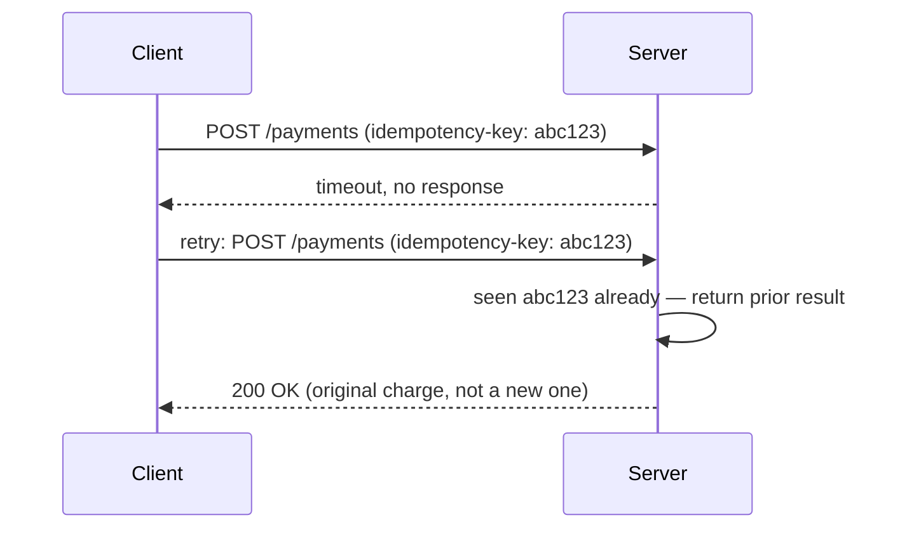

## What it is

An operation is **idempotent** if performing it more than once has the same
effect as performing it once. `PUT /users/5 { name: "Alex" }` is idempotent —
running it three times leaves the same end state as running it once.
`POST /payments { amount: 10 }` is not — running it three times charges the
card three times.

## Why it matters

Networks fail in the middle of requests. A client that times out waiting for
a response has no way to know whether the server actually processed the
request or not — so the only safe move is to retry. Idempotency is what
makes that retry safe: if the first attempt _did_ go through, the retry is a
no-op instead of a duplicate side effect.



## Idempotency keys

For operations that aren't naturally idempotent (like "charge a card"), the
standard fix is an **idempotency key** — a client-generated unique id sent
with the request. The server remembers keys it has already processed and
returns the original result instead of repeating the side effect:

```python
def charge_card(idempotency_key, amount):
    existing = db.find_by_idempotency_key(idempotency_key)
    if existing:
        return existing.result  # already processed — return it, don't re-charge

    result = payment_gateway.charge(amount)
    db.save_idempotency_key(idempotency_key, result)
    return result
```

The key is usually generated once per logical user action (e.g. once per
"place order" click) and reused across all retries of that same action —
generating a new key per retry defeats the purpose entirely.

## Where it applies

- **Payment APIs** — Stripe, for example, requires an `Idempotency-Key`
  header on charge creation for exactly this reason.
- **Message queues** — consumers should be idempotent, since most queues
  guarantee _at-least-once_ delivery, not _exactly-once_.
- **Database writes** — `UPSERT`/`INSERT ... ON CONFLICT` are idempotent by
  construction; a naive `INSERT` retried after a timeout can create
  duplicates.

## Key insight

Idempotency doesn't prevent failures — it makes retrying after a failure
safe. Anywhere a client might retry a request it's not sure succeeded (which
is almost everywhere, over a real network), the operation either needs to be
naturally idempotent or needs an idempotency key to fake it.
