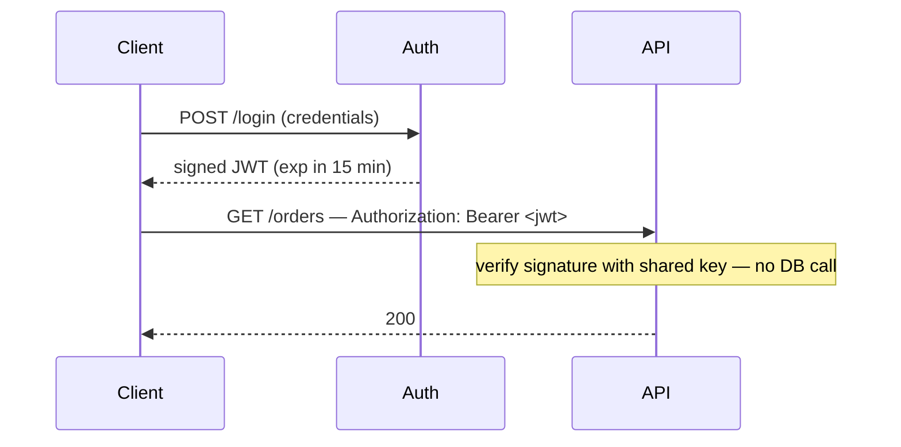

## What it is

A JSON Web Token is three base64url-encoded parts joined by dots:
`header.payload.signature`.

```json
// payload (the middle part) — decoded
{
  "sub": "user_42",
  "role": "admin",
  "iat": 1735689600,
  "exp": 1735693200
}
```

The signature is an HMAC (shared secret) or RSA/ECDSA (private key) over
the header and payload. Anyone holding the secret or public key can verify
that the payload is untampered and was issued by someone who holds the
signing key — **without a database lookup**.

Note what the signature does _not_ do: a JWT is signed, not encrypted.
Anyone who has the token can read every claim in it. Never put secrets in
the payload.

## Why it matters

Verification is stateless. Any service with the key can validate a token
locally, so there's no round-trip to a central session store on every
request — convenient for microservices and for scaling horizontally behind
a load balancer with no sticky sessions.



## The tradeoffs

- **Revocation is hard.** A signed token is valid until it expires. There's
  no "log out everywhere" without adding state back — a short `exp` plus
  refresh tokens, a denylist of revoked IDs, or a per-user token version
  you check on sensitive actions.
- **Algorithm attacks.** `alg: none` and RS256/HS256 confusion have both
  been real vulnerabilities. Pin the expected algorithm server-side; never
  trust the `alg` field in the incoming header.
- **Size.** A JWT is far larger than an opaque session ID and rides on
  every request.

## Where it applies

API access tokens, service-to-service auth, and the ID token in
[OAuth 2.0 & OpenID Connect](/guides/oauth). For a classic server-rendered
web app with one backend, a session cookie is usually simpler and gives you
instant revocation — see
[Session vs. Token Authentication](/nuggets/session-vs-token-auth).

## Treat it as a bearer token

Whoever holds the token can use it. Keep `exp` short, send it only over
TLS, and store it with care: a token in `localStorage` is readable by any
[XSS](/nuggets/xss) payload, while an `HttpOnly` cookie can't be read by JS
but then needs [CSRF](/nuggets/csrf) defenses. There's no storage location
that's free of tradeoffs.
