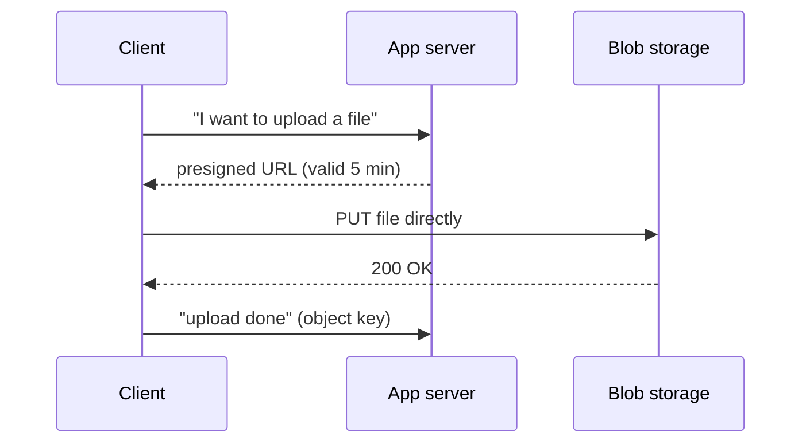

## What it is

Routing a large file (a video, a big export, a multi-GB backup) through
your own application server (reading the whole upload into memory or
disk before forwarding it to storage) ties up a server thread or
process for the entire transfer and caps throughput at whatever one
server can handle. The standard fix is letting the client upload
**directly** to [blob storage](/guides/blob-storage), with the app server
only involved in authorizing the upload.

## Presigned URLs

The app server generates a short-lived, cryptographically signed URL
that grants permission to upload (or download) one specific object,
without the client ever holding real storage credentials:

```python
url = s3_client.generate_presigned_url(
    "put_object",
    Params={"Bucket": "uploads", "Key": f"user-{user_id}/{file_id}"},
    ExpiresIn=300,  # seconds the URL stays valid
)
# client PUTs the file directly to `url` — bypasses the app server entirely
```



The app server's job shrinks to authorization and bookkeeping: it
never touches the file's bytes, so its resource usage doesn't scale
with upload size or volume at all.

## Chunked / multipart upload

For very large files, uploading as one request risks the whole thing
failing on any network hiccup, with no way to resume. Multipart upload
splits the file into independently-uploaded chunks (each with its own
presigned URL), retried individually on failure, and assembled
server-side (by the storage service) once every chunk has arrived, the
same idea as resumable downloads, applied to writes.

## Where it applies

Any user-facing upload of non-trivial size — video platforms,
document/backup tools, image-heavy apps. Also the receiving side of the
same problem: serving a large file back out is the same "don't proxy
bytes through the app server" idea, usually via a signed download URL
or a [CDN](/guides/cdn) in front of storage.

## The app server's actual job

In a large-transfer flow, the app server's job is authorization, not
data-plane transit. Every byte that flows through it instead of
directly between client and storage is throughput it didn't need to
spend.
