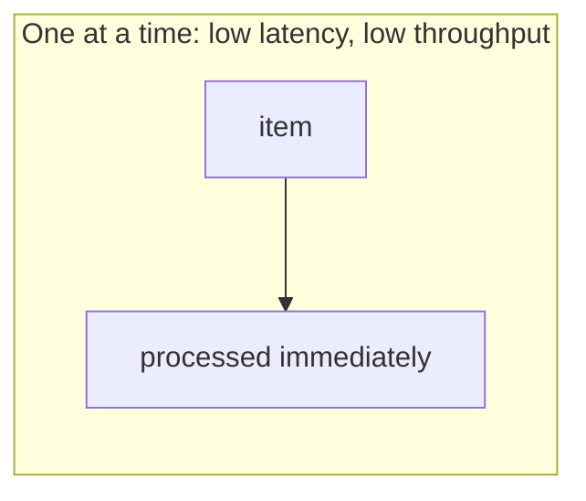
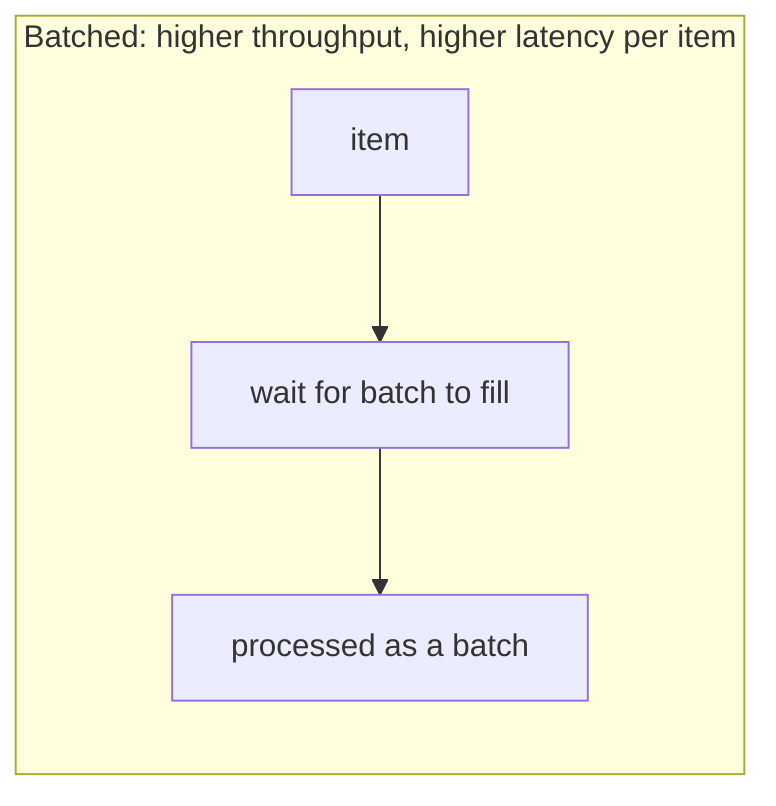

## What it is

**Latency** is how long a single request takes to complete — "the response
came back in 120ms." **Throughput** is how much work a system gets through
per unit of time — "5,000 requests per second." They sound related, but
they're not the same measurement, and optimizing one can actively hurt the
other.

## Why it matters

**Batching** is the clearest example of the tradeoff. Processing items one
at a time keeps each item's latency low (it's handled immediately) but
caps throughput at whatever a single item costs. Batching many items
together amortizes fixed overhead (a network round-trip, a database
transaction) across all of them, raising throughput. But now the first
item in the batch has to wait for the batch to fill before it's processed
at all, raising its latency.

The same tension shows up with concurrency: adding more workers increases
throughput up to a point, but beyond that point, contention (lock waits,
CPU context-switching, queueing for a shared resource) starts increasing
the latency of each individual request even as total throughput keeps
climbing.

## Little's Law

A useful formula connecting the two: `L = λW` — the average number of
requests in a system (`L`) equals the arrival rate (`λ`) times the average
time each request spends in the system (`W`, i.e. latency). It's a
reminder that these numbers are mechanically linked: if throughput
(arrival rate) goes up and latency doesn't drop to compensate, the system
ends up holding more in-flight requests at once, which usually means
queueing, and queueing usually means latency gets worse next, not better.

For example: a service handling 50 requests/second (`λ`), each taking
200ms (`W` = 0.2s), has on average `L = 50 × 0.2 = 10` requests in flight
at any given moment: that's the concurrency it needs to sustain just to
keep up, before queueing even starts. (See also
[numbers every engineer should know](/nuggets/numbers-every-engineer-should-know)
for the raw latencies these estimates build on.)

## Where it applies

System design generally — a search-autocomplete endpoint needs low latency
even at some throughput cost (a slow suggestion is useless even if the
backend could technically handle more), while a nightly batch ETL job wants
maximum throughput and can tolerate high latency for any single record.
[Choosing between a synchronous request/response API and an async queued
one](/nuggets/long-running-tasks) is usually a latency-vs-throughput
decision in disguise.

## Which one wins

Most systems can't maximize both at once — there's a real design decision
in which one matters more for a given workload, and that answer differs by
endpoint, not just by system. Optimizing for the wrong one (batching a
user-facing request for throughput, or handling a bulk job one row at a
time for low per-row latency) is a common, avoidable performance mistake.
