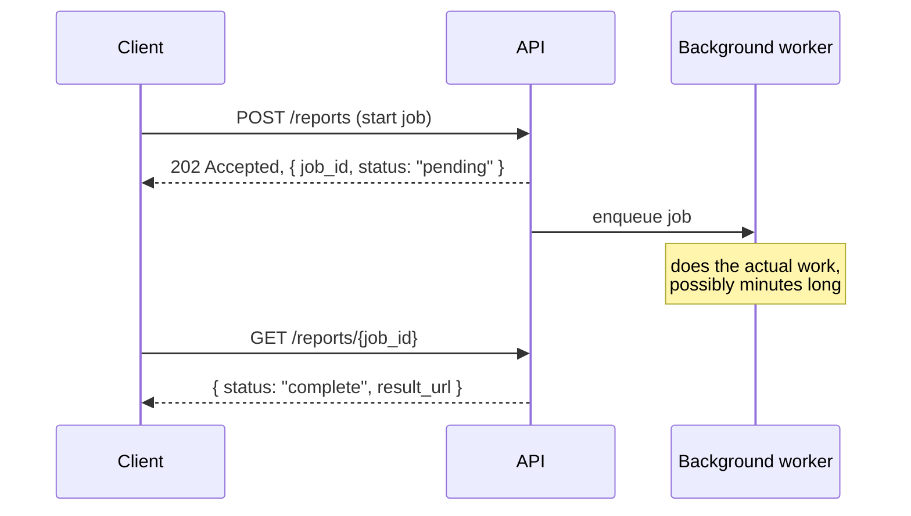

## What it is

Some operations — video transcoding, a large report generation,
training a model — take far longer than an HTTP request should stay
open for. The request that *starts* the work and the moment the
*result* is ready need to be decoupled, with a defined way for the
client to find out when it's done.

## The pattern

The initial request returns immediately with a job id and a
`202 Accepted` (not `200`, since nothing is actually done yet) — the
real work happens asynchronously in a worker process, decoupled from
the request/response cycle entirely.

## How the client finds out

- **Polling** — the client periodically calls `GET /reports/{job_id}`
  and checks status. Simple, works everywhere, but wastes requests and
  adds latency equal to the poll interval before the client notices
  completion.
- **Webhooks** — the server calls a URL the client registered, once
  done. No wasted requests, but requires the client to run something
  reachable from the server (fine for server-to-server, awkward for a
  browser).
- **WebSocket/SSE push** — the server pushes a status update over an
  already-open connection. Lowest latency, but only works while the
  client stays connected — needs a fallback (like polling on reconnect)
  for when it doesn't.

## Idempotency and retries

The worker picking up a job should be
[idempotent](/nuggets/idempotency) — a worker crash mid-job, or a
message redelivered by an at-least-once queue, means the same job can
be picked up twice. Track job state explicitly (`pending` → `running` →
`complete`/`failed`) so a duplicate pickup can check "is this already
done or in progress" before redoing the work.

## Where it applies

Any operation whose natural duration exceeds a reasonable request
timeout: exports and reports, media processing, batch imports, ML
inference on large inputs. The underlying mechanics (a durable job
queue, idempotent workers) are shared with
[the Outbox Pattern](/nuggets/outbox-pattern) and
[the Saga Pattern](/nuggets/saga-pattern) — all three are variations on
"do work reliably, outside the request/response cycle."

## Key insight

The request that kicks off long-running work and the moment it finishes
are two different events on two different timescales — trying to force
them into one request/response cycle either times out or blocks a
thread for far too long. Split them, and give the client an explicit
way to check on the gap in between.
