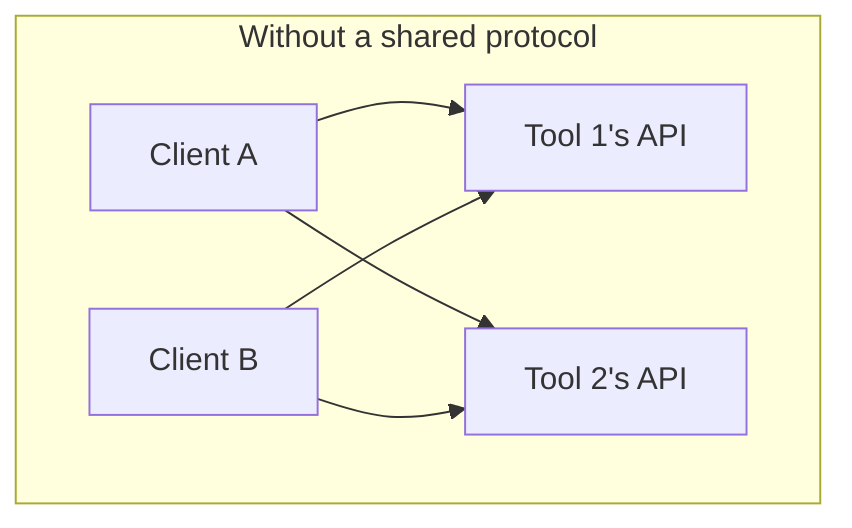
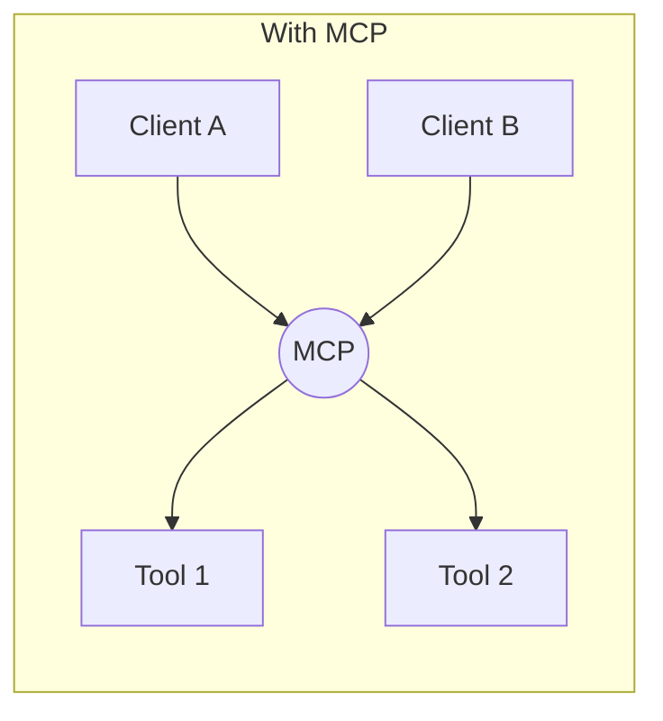

## What it is

An **API** is a contract for how one program calls another — shaped
however that service's authors chose (REST endpoints, RPC methods, a
GraphQL schema). A client has to be written specifically for that one
API. **MCP** (Model Context Protocol) is a standardized protocol for
connecting an AI model or agent to tools and data sources — one common
interface (list the available tools, call a tool, fetch a resource) that
any MCP-compatible client can speak, regardless of what's actually running
behind it.

## Why it matters

Before MCP, wiring an LLM agent up to a new tool meant writing custom glue
code that translated between the model's function-calling format and that
particular service's own API shape — every new integration, for every
client, from scratch. MCP standardizes that last mile: a server author
implements the MCP interface once, and any MCP client (Claude Desktop,
Claude Code, or anything else that speaks the protocol) can use it without
bespoke integration code.





Without a shared protocol, connecting `N` clients to `M` tools takes up to
`N × M` custom integrations. With a shared protocol, it takes `N + M` — each
client implements MCP once, each tool exposes an MCP server once.
[Language Server Protocol](https://microsoft.github.io/language-server-protocol/)
solved the exact same problem for code editors and language tooling, and
MCP is explicitly modeled on that idea.

## Example: what a tool call actually looks like

Calling a REST API directly means knowing its specific shape in advance,
including its base URL, its auth scheme, and this particular endpoint's
parameters:

```
GET /repos/octocat/hello-world/issues?state=open
Authorization: Bearer <token>
```

An MCP client never needs to know that shape ahead of time. It asks the
server what tools it offers, then calls one by name with arguments: the
same two-step shape for any MCP server, whether it's wrapping GitHub's
API, a local database, or a file system (this is simplified — the real
protocol is JSON-RPC 2.0 with additional envelope fields):

```json
// 1. discover: "what can you do?"
{ "name": "list_issues",
  "description": "List open issues in a repo",
  "inputSchema": { "repo": "string", "state": "string" } }

// 2. call: invoke it by name, not by URL
{ "tool": "list_issues",
  "arguments": { "repo": "octocat/hello-world", "state": "open" } }
```

## MCP doesn't replace APIs

An MCP server is very often just a thin wrapper _around_ an existing
API — a database, a REST service, a file system. MCP doesn't eliminate
the underlying API; it standardizes how an AI agent _discovers and calls_
whatever's behind that wrapper, so the agent doesn't need integration
code written specifically for that one service.

## Where it applies

Building or connecting tools for an LLM agent (file access, database
queries, third-party services): MCP is the layer between "the model wants
to take an action" and "the actual system that performs it," regardless of
what that system's own native API looks like.

## Different layers, not rivals

MCP and APIs solve different layers of the same problem: an API defines
what a service can do; MCP defines a common way for an AI agent to
discover and call _any_ service's capabilities without one-off integration
work per client, per tool.

MCP itself is a young, fast-moving spec — the discover/call shape above
is stable, but transport and session details have already changed more
than once (a 2026-07-28 revision moved the protocol to a stateless
transport, for one). Treat the mental model here as durable and check
the current spec at [modelcontextprotocol.io](https://modelcontextprotocol.io)
before relying on wire-level specifics.
