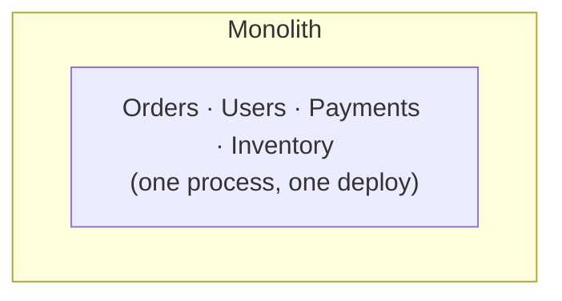
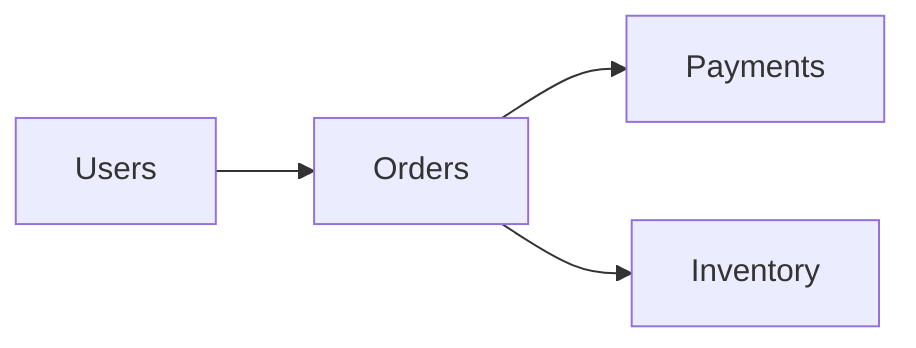

## What it is

A **monolith** is a single deployable unit containing all of an
application's functionality — one codebase, one build, one deploy.
**Microservices** split the application into many independently deployable
services, each owning a narrow piece of functionality, talking to each
other over the network.

## Why it matters

This is one of the most debated architecture decisions of the last
decade, and the industry consensus has genuinely shifted — from "everyone
should do microservices" in the mid-2010s to a more sober "start with a
monolith" default today, with some well-known microservices adopters
having since consolidated services back together. Both styles have real
costs that are easy to underestimate from the outside.

**Monolith tradeoffs**: simpler local development, testing, and
debugging — a stack trace is just a stack trace, not a hunt across five
services' logs. Deploys and (usually) database transactions are atomic. No
network calls between internal components means none of the distributed-
systems failure modes apply _internally_. The cost: the whole application
scales as one unit even if only one feature is actually under load, and a
large team working in one codebase creates real coordination friction.

**Microservices tradeoffs**: independent deployability (teams ship on
their own schedule) and independent scaling (scale only the service that's
hot). The cost is substantial operational complexity — service discovery,
network calls that can now fail or time out (needing
[retries with backoff](/nuggets/exponential-backoff),
[circuit breakers](/nuggets/circuit-breaker), and
[rate limiting](/nuggets/rate-limiting)), no more single-database ACID
transaction spanning the whole operation (needing patterns like the
[outbox pattern](/nuggets/outbox-pattern) and idempotent
consumers — see [idempotency](/nuggets/idempotency)), and debugging a
feature that now spans five services requires real
[observability](/nuggets/observability), not just a debugger attached to
one process. [CAP theorem](/nuggets/cap-theorem) tradeoffs, largely
invisible inside a monolith's single database, become unavoidable the
moment state is split across services.

## Where it applies

Choosing how to structure a new application, or deciding whether to split
an existing one. It's also the context behind "modular monolith" — a
single deployable unit internally organized into clearly separated
modules with disciplined boundaries, aiming to keep the simplicity of one
deploy while making a future split easier if it's ever actually needed.

## Key insight

Microservices trade simplicity for independent scalability and
deployability — and that trade only pays off once team size, deploy-cadence
conflicts, or scaling needs actually justify the distributed-systems
complexity it costs. Adopting microservices before that need is real is a
common, expensive mistake: all of the operational cost, none of the
benefit yet. The safer default is a well-organized monolith, splitting out
a service only when a specific, concrete pain point demands it.
