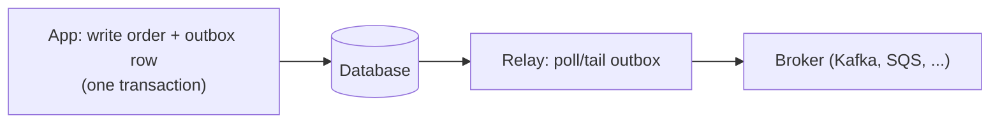

## What it is

The **outbox pattern** reliably publishes an event as part of a database
change, by writing the event to an "outbox" table in the _same_ transaction
as the business data — then relaying it to a real message broker
separately.

## Why it matters

Say an order service needs to both save an order to Postgres _and_ publish
an `OrderCreated` event to Kafka. Doing that as two separate steps — commit
to the database, then publish to the broker — has no atomic guarantee
across two different systems. If the process crashes between the two
steps, you either lose the event (crash before publishing) or, if you
retry the whole operation, risk creating a duplicate order. This is the
**dual-write problem**, and there's no way to wrap a database commit and a
Kafka publish in one transaction — they're different systems with no
shared coordinator.

## How it works

Instead of publishing directly, write the event to an outbox table
alongside the business data, in one transaction:

```sql
BEGIN;
INSERT INTO orders (id, customer_id, total) VALUES ('o1', 'c1', 42.00);
INSERT INTO outbox (id, event_type, payload, sent)
  VALUES ('e1', 'OrderCreated', '{"order_id": "o1"}', false);
COMMIT;
```

A separate relay process — polling the table, or tailing the database's
write-ahead log (Debezium-style change data capture) — reads unsent outbox
rows, publishes them to the real broker, and marks them sent:



Because the event and the business data commit atomically, the event can
never be lost, and it's never published before the data it describes
actually exists.

## Where it applies

Any service that needs "change the database" and "notify the rest of the
system" to happen together — order processing, inventory updates, anything
event-driven built on a relational store.

## Key insight

The outbox pattern trades an unsafe dual-write for a safe single-write plus
a relay — at the cost of _at-least-once_ delivery (the relay can crash
after publishing but before marking a row sent, and will re-publish it).
That's exactly why consumers of these events need to be
[idempotent](/nuggets/idempotency): the reliability the outbox pattern
buys you on the publish side only pays off if the receive side can safely
handle the same event twice.
