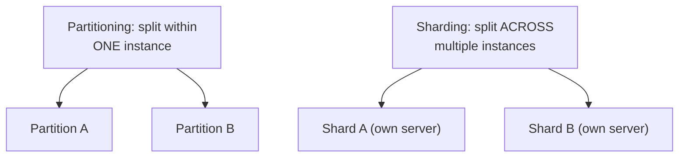

## What it is

Both split a large dataset into smaller pieces, but at a different
scope. **Partitioning** is the general term: dividing data into pieces
by some rule (range, list, hash), which can happen entirely within
*one* database instance. **Sharding** is specifically partitioning
*across multiple* machines — every shard is a partition, but not every
partition is a shard.

## Partitioning within one instance

Most relational databases support this natively — Postgres's
declarative table partitioning, for example, splits one logical table
into several physical ones on the *same* server, transparent to
queries:

```sql
CREATE TABLE events (
  id bigint,
  created_at timestamp,
  payload jsonb
) PARTITION BY RANGE (created_at);

CREATE TABLE events_2026_01 PARTITION OF events
  FOR VALUES FROM ('2026-01-01') TO ('2026-02-01');
```

The database can then **prune** partitions a query doesn't need: a
query filtered to `2026-01` never touches the other months' data at
all. This improves query and maintenance performance (dropping a whole
old partition is instant; deleting the same rows one at a time isn't),
without adding a single extra server or any of the distributed-systems
complexity sharding brings.

## Sharding: partitioning across machines

Sharding takes the same splitting idea and distributes the pieces
across multiple database *instances*, specifically to scale beyond what
one machine's storage or throughput can handle. This is where
[Sharding Strategies](/nuggets/sharding-strategies) picks up: choosing
a shard key, avoiding hot shards, handling resharding (none of which
is a concern for single-instance partitioning, since there's only ever
one machine to route to).



## Why the distinction matters

The two terms are often used interchangeably in casual conversation,
but conflating them misses the actual design decision: partitioning
alone doesn't add capacity (all partitions still live on one machine,
sharing its CPU, memory, and disk). It only improves organization and
query efficiency *within* that capacity. Sharding is what actually adds
capacity, at the cost of everything cross-shard queries, joins, and
transactions become harder or impossible without.

## Where it applies

Partitioning: a single database instance with a table too large to
manage or query efficiently as one block (time-series and event tables
are the classic case). Sharding: a dataset or write volume that has
genuinely outgrown what one instance can hold or serve at all.

## When partitioning alone is enough

Partitioning is an organizational technique available on a single
machine; sharding is a scaling technique that requires multiple. If a
database is struggling with query performance or table maintenance but
isn't actually running out of capacity, partitioning alone might be the
entire fix. Reaching straight for sharding's operational complexity
when partitioning would have solved it is a common overcorrection.
