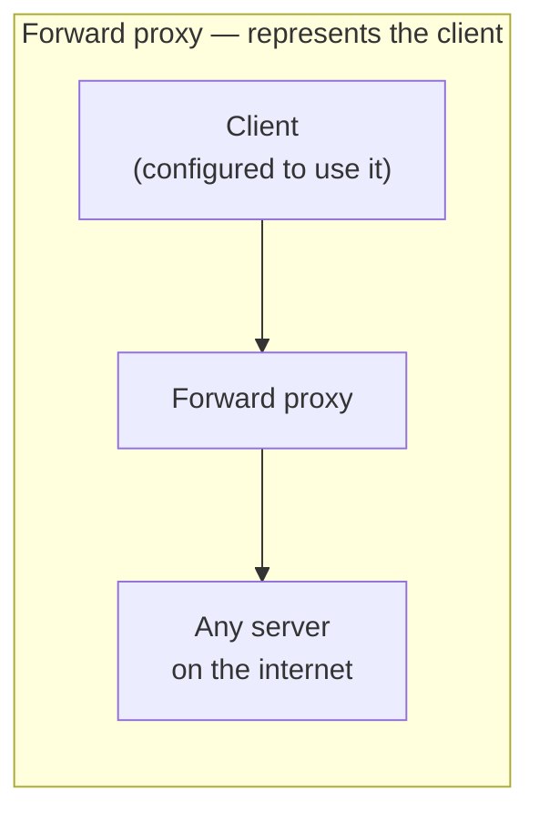
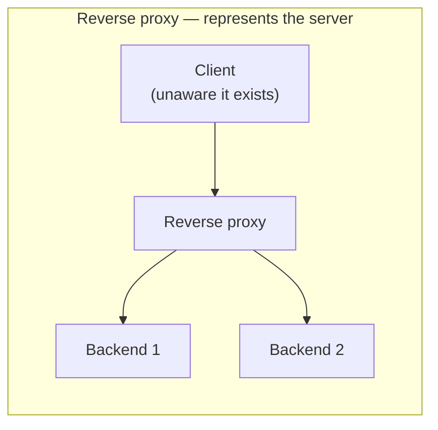

## What it is

Both sit between a client and a server, forwarding requests on someone's
behalf; the difference is **whose** behalf. A **forward proxy** (usually
just called "a proxy") sits in front of *clients*, forwarding their
requests out to the internet: the destination server sees the proxy's
IP, not the client's, and the client has to be configured to use it. A
**reverse proxy** sits in front of *servers*, forwarding client requests
to whichever backend should actually handle them. The client sees only
the reverse proxy's address and has no idea how many backends exist, or
which one answered.

## Why it matters

**Forward proxies** solve client-side problems: anonymizing outbound
traffic, enforcing a content policy across every client on a network
(a school or company blocking certain sites), or letting a group of
clients share a cache instead of each fetching the same resource
independently.

**Reverse proxies** solve server-side problems, and this is the shape
that shows up constantly in system design — almost every production
web service sits behind one:

- **TLS termination** — decrypt HTTPS once, at the proxy, and forward
  plain HTTP internally, so individual backend instances never have to
  manage certificates themselves.
- **Load balancing** — distribute requests across backend instances;
  see [Networking: Load Balancing](/guides/networking-load-balancing)
  for the algorithms this actually uses.
- **Caching and compression** — serve a cached or compressed response
  without the request ever reaching a backend.
- **Hiding topology** — the client only ever sees one address; backend
  instances can be added, removed, or replaced with no client-visible
  change.

## Reverse proxy vs. load balancer vs. API gateway

These three terms describe overlapping roles, not three different
technologies: NGINX, HAProxy, and Envoy can each be configured to act
as any of them. The distinction is *primary purpose*:

- **Reverse proxy** is the general shape: sits in front of servers,
  forwards requests.
- **Load balancer** is a reverse proxy whose main job is distributing
  traffic across instances for scale and availability.
- **[API Gateway](/guides/api-gateway)** is a reverse proxy whose main
  job is API-specific concerns — auth, rate limiting, routing to the
  right microservice.

A [CDN](/guides/cdn) is, in effect, a globally-distributed reverse
proxy: the same "hide the origin, serve from somewhere closer/cached"
idea, applied across many geographic edge locations instead of one
data center.

## The current tooling landscape (2026)

Worth knowing the actual tradeoffs, not just the names:

- **NGINX** is still the single most-used web server/reverse proxy —
  32.8% of websites with a known web server run it (W3Techs, April
  2026). But a config reload causes a real, measurable latency spike
  per worker (~50ms), which can surface as 5xx errors if health checks
  aren't tuned around it.
- **Caddy** ships automatic HTTPS by default and benchmarks meaningfully
  faster than NGINX on small static assets and HTTP/3, at the cost of
  fewer load-balancing algorithms and lighter health-check options:
  a better fit for simpler setups than heavy-duty traffic shaping.
- **Envoy** is the data plane most service meshes are built on (used
  at Lyft, and inside AWS App Mesh): deep observability and traffic
  control, at the cost of a genuinely more complex configuration model.
- **Pingora** is Cloudflare's proxy framework, written in Rust: notably
  not a pre-built binary you configure with a file, like the others,
  but a library you build a proxy *with*. Cloudflare reported ~70% less
  CPU and ~67% less memory than the NGINX setup it replaced, running at
  over 40 million requests/second.

## Where it applies

Reverse proxies: essentially every production web service, API, and
CDN edge node. Forward proxies: corporate/school network content
filtering, web scraping infrastructure, and privacy tools (a VPN is,
among other things, a forward proxy for all of a device's traffic).

## Telling them apart

**Who it represents** is the test that actually works, more than where
a box sits on a network diagram. A forward proxy sits on the client's
side, and the client knows it's there. A reverse proxy sits on the
server's side, and the client has no idea it exists at all: as far as
the client can tell, the reverse proxy *is* the server.
