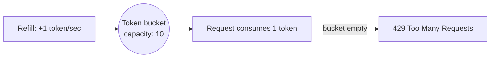

## What it is

Rate limiting caps how many requests a client can make in a given window,
protecting a shared service from being overwhelmed by any single caller —
the server-side sibling of [Circuit Breaker](/nuggets/circuit-breaker),
which protects a _caller_ from a struggling dependency.

## Algorithms

**Token bucket**: a bucket holds up to `capacity` tokens and refills at a
fixed rate. Each request consumes one token; if the bucket is empty, the
request is rejected or delayed. This allows short bursts up to the bucket
size, as long as the average rate stays within the refill rate.



**Leaky bucket**: requests queue up and are processed at a fixed rate
regardless of how bursty their arrival was — it smooths traffic to a
constant output rate rather than allowing bursts through.

```python
class TokenBucket:
    def __init__(self, capacity, refill_rate_per_sec):
        self.capacity = capacity
        self.tokens = capacity
        self.refill_rate = refill_rate_per_sec
        self.last_refill = time.monotonic()

    def allow(self):
        now = time.monotonic()
        elapsed = now - self.last_refill
        self.tokens = min(self.capacity, self.tokens + elapsed * self.refill_rate)
        self.last_refill = now

        if self.tokens >= 1:
            self.tokens -= 1
            return True
        return False
```

## Why it matters

Without rate limiting, a single misbehaving client — a bug, a retry storm,
or a malicious actor — can consume all of a shared resource, degrading the
service for every other client. It's the same class of failure that
[Exponential Backoff](/nuggets/exponential-backoff) and Circuit Breaker
protect against, but from the other side: those protect a caller from a
failing dependency, rate limiting protects a dependency from too many
callers.

## Where it applies

Public APIs (Stripe, GitHub, and most SaaS APIs rate-limit per API key),
internal service-to-service calls in a microservice architecture, and
login endpoints (rate limiting is a standard defense against brute-force
attacks).

## Key insight

Rate limiting and circuit breakers are complementary, not interchangeable:
one protects a shared resource from its callers, the other protects a
caller from a failing dependency. A resilient system generally needs both,
on both sides of every important call.
