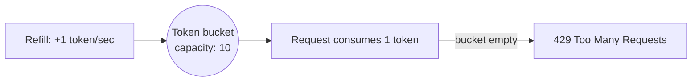

## What it is

Rate limiting caps how many requests a client can make in a given window,
protecting a shared service from being overwhelmed by any single caller —
the server-side sibling of [Circuit Breaker](/nuggets/circuit-breaker),
which protects a _caller_ from a struggling dependency.

## Algorithms

**Token bucket**: a bucket holds up to `capacity` tokens and refills at a
fixed rate. Each request consumes one token; if the bucket is empty, the
request is rejected or delayed. This allows short bursts up to the bucket
size, as long as the average rate stays within the refill rate.



**Leaky bucket**: requests queue up and are processed at a fixed rate
regardless of how bursty their arrival was — it smooths traffic to a
constant output rate rather than allowing bursts through.

```python
class TokenBucket:
    def __init__(self, capacity, refill_rate_per_sec):
        self.capacity = capacity
        self.tokens = capacity
        self.refill_rate = refill_rate_per_sec
        self.last_refill = time.monotonic()

    def allow(self):
        now = time.monotonic()
        elapsed = now - self.last_refill
        self.tokens = min(self.capacity, self.tokens + elapsed * self.refill_rate)
        self.last_refill = now

        if self.tokens >= 1:
            self.tokens -= 1
            return True
        return False
```

## Why it matters

Without rate limiting, a single misbehaving client — a bug, a retry storm,
or a malicious actor — can consume all of a shared resource, degrading the
service for every other client. It's the same class of failure that
[Exponential Backoff](/nuggets/exponential-backoff) and Circuit Breaker
protect against, but from the other side: those protect a caller from a
failing dependency, rate limiting protects a dependency from too many
callers.

## Sliding window: the more precise alternative

Token/leaky bucket track a running balance, not actual request timestamps
— which is efficient but imprecise at window boundaries: a client could
send a full burst right before a fixed window resets and another right
after, doubling up right at the seam. Two sliding-window approaches fix
that at different cost points:

- **Sliding window log** — store the timestamp of every request (e.g. in
  a Redis sorted set), and on each new request, evict everything older
  than `now - window` and count what's left. Exactly correct, but memory
  scales with request volume per key, not with a constant.
- **Sliding window counter** — an approximation that stays O(1): keep a
  count for the current fixed window and the previous one, and weight the
  previous window's count by how much of it still overlaps the sliding
  window:

  ```python
  def sliding_window_count(current_count, previous_count, elapsed_fraction):
      # elapsed_fraction: how far into the current window "now" is (0.0-1.0)
      return current_count + previous_count * (1 - elapsed_fraction)
  ```

  This assumes requests were spread evenly through the previous window,
  which isn't exactly true, but it's a close enough approximation for most
  rate limiters, at a fraction of the log's memory cost.

## Making it work across multiple servers

A counter that lives in one process's memory only limits requests hitting
_that_ process — behind a load balancer with 10 instances, each enforcing
"100 requests/minute" independently effectively allows 1,000. The fix is
centralizing the counter somewhere every instance shares, typically
Redis:

```
INCR ratelimit:user:42
EXPIRE ratelimit:user:42 60
```

Run as two separate commands, this has a race: if the process crashes (or
the connection drops) between `INCR` and `EXPIRE`, that key never expires
and silently rate-limits the user forever. The fix is making the
check-and-increment atomic — either a Lua script (Redis executes a script
as a single atomic step) or `SET key 1 NX EX 60` to create-with-expiry
only on the very first request in a window, then plain `INCR` afterward:

```lua
-- atomic in Redis: increment, and set the expiry only on the first hit
local count = redis.call('INCR', KEYS[1])
if count == 1 then
    redis.call('EXPIRE', KEYS[1], ARGV[1])
end
return count
```

## Where it applies

Public APIs (Stripe, GitHub, and most SaaS APIs rate-limit per API key),
internal service-to-service calls in a microservice architecture, and
login endpoints (rate limiting is a standard defense against brute-force
attacks).

## Key insight

Rate limiting and circuit breakers are complementary, not interchangeable:
one protects a shared resource from its callers, the other protects a
caller from a failing dependency. A resilient system generally needs both,
on both sides of every important call.
