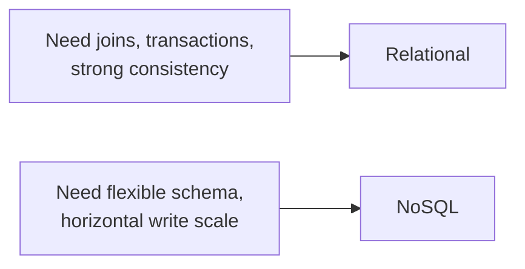

## What it is

**SQL (relational) databases** store data in tables with a fixed schema
and enforce relationships between them, queried with SQL and typically
offering strong consistency and full ACID transactions. **NoSQL** is an
umbrella term for everything that isn't that — document stores (MongoDB),
key-value stores (DynamoDB, Redis), wide-column stores (Cassandra), and
graph databases — generally trading some of that structure and consistency
for flexibility or horizontal scale.

## Why it matters

The two aren't just "old vs. new"; they encode genuinely different
answers to real tradeoffs:

- **Schema**: a relational database enforces its schema on every write,
  catching malformed data immediately but making changes to that schema a
  coordinated migration (see [expand-contract](/nuggets/expand-contract)).
  Most document stores let each record's shape vary, which is flexible
  during early, fast-changing development but pushes the burden of
  validating "does this document actually look right" onto application
  code instead of the database.
- **Relationships**: SQL is built for joining related data across tables
  in a single query. NoSQL stores generally aren't — related data is
  often denormalized (duplicated) into a single document specifically to
  avoid needing a join, trading storage and update complexity for
  read speed.
- **Consistency vs. scale**: this is [CAP theorem](/nuggets/cap-theorem) in
  practice. Traditional relational databases are usually CP: strongly
  consistent, single-writer, harder to horizontally scale across regions.
  Many NoSQL stores are built AP-first: eventually consistent, but able
  to scale writes horizontally across many nodes, often using
  [consistent hashing](/nuggets/consistent-hashing) to distribute data.



The same data, modeled each way:

```sql
-- SQL: related data stays normalized, joined at query time
SELECT orders.id, orders.total, customers.name
FROM orders JOIN customers ON customers.id = orders.customer_id;
```

```json
// Document store: the related data is denormalized into the order itself —
// no join needed to read it, but the customer's name now has to be kept in
// sync everywhere it's duplicated.
{
  "orderId": "o1",
  "total": 42.0,
  "customer": { "id": "c1", "name": "Alex" }
}
```

## Where it applies

Choosing a primary data store for a new service, or recognizing when a
service using the "wrong" one for its access patterns is fighting its
database instead of being helped by it — a reporting system doing complex
ad-hoc joins wants SQL; a system ingesting a huge, bursty write volume of
loosely structured events often wants NoSQL.

## Picking one

Most real systems that live long enough end up using both, choosing
per-service or even per-data-type rather than committing one database to
the entire application. Framing the decision as "SQL or NoSQL" skips the
actual question, which is what this specific data needs: relationships,
transactions, and a fixed shape point toward SQL; flexible structure and
horizontal write scale point toward NoSQL. Neither wins in general, only
for a given access pattern.
