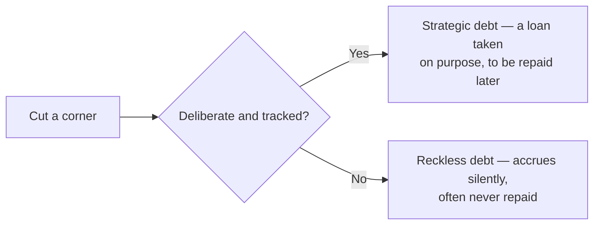

## What it is

**Technical debt** is the cost of shortcuts taken now — skipped tests, a
hacky implementation, missing error handling, copy-pasted code — that
make future changes slower and riskier. **Time to market** is how fast
something can actually ship and get in front of real users. Doing it "the
right way" takes longer; cutting corners ships faster and defers the cost.
Neither "always do it right" nor "always ship the fastest possible thing"
is the correct answer on its own — the right balance depends on what's
actually being learned or won by shipping sooner.

## Why it matters

The debt metaphor is genuinely useful, not just a cute analogy, if taken
seriously: like financial debt, technical debt has interest. Every future
change to that hacky, undertested part of the codebase is slower and
riskier than it would have been done properly — until the debt is paid
down (refactored) or retired (that code stops being used). Left unpaid, it
compounds: each new feature built on top of a shortcut has to work around
it, and the shortcut gets more expensive to fix the longer it's load-bearing.

## Deliberate debt vs. reckless debt

This is the distinction that actually matters, more than "debt exists or
it doesn't." Debt taken on **deliberately** — a conscious decision to ship
the fast version first, in order to learn whether a feature is even worth
the investment, with an explicit plan to revisit it — is a legitimate
strategic tool. Debt taken on **recklessly** — not a decision at all, just
not knowing better, or running out of time and never coming back to it —
is the dangerous kind. It's invisible until it isn't, and by the time it's
visible (velocity has quietly ground down, or a "small" change turns out
to touch code nobody wants to modify) it's expensive to unwind.

## Where it applies

Startup MVPs and feature deadlines (where speed genuinely has outsized
value — a feature validated a week sooner might not need to exist at
all), sprint planning conversations about whether to refactor now or
later, and code review, where flagging a shortcut explicitly is what
turns reckless debt into deliberate, tracked debt.

## Key insight

The mistake isn't taking on technical debt — sometimes that's the right
call. The mistake is taking it on unconsciously, or without a real plan to
pay it back. Name the shortcut explicitly (a TODO, a ticket, a comment
explaining what was skipped and why) so it stays a deliberate decision
instead of quietly becoming permanent.
