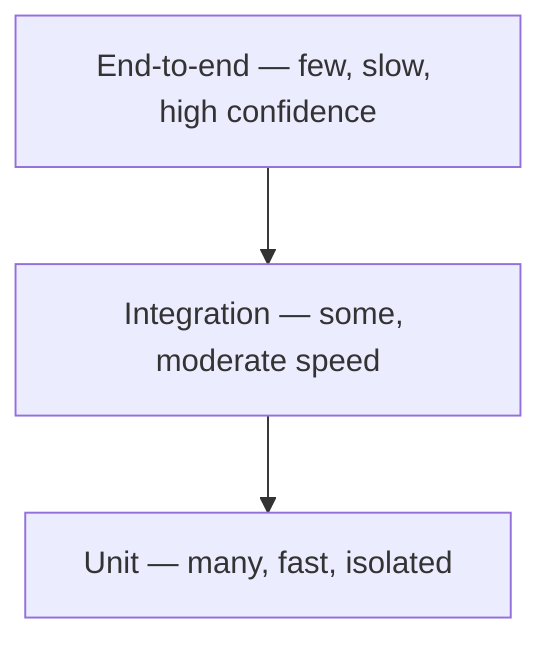

## What it is

A model for how a healthy test suite should be shaped: many small, fast
**unit tests** at the base, fewer **integration tests** in the middle, and
a small number of slow **end-to-end tests** at the top.

## Why it matters

Inverting the pyramid — mostly end-to-end tests, few unit tests, sometimes
called the "ice cream cone" — is a common trap. End-to-end tests are slow
and prone to flaking on things unrelated to the actual bug (timing,
network, test environment), so a suite dominated by them becomes slow
enough, and unreliable enough, that people start skipping it. Unit tests
are fast and precise — a failure points at almost exactly the broken
line — so they should carry the bulk of the coverage.

## The layers

- **Unit** — one function or class, in isolation, no real I/O.
  Milliseconds each; thousands can run in seconds. Should cover the
  majority of logic and edge cases.
- **Integration** — a few real pieces working together (a repository
  against a real test database, for example) — catches the bugs that
  unit tests with mocks miss, like a query that doesn't actually match the
  real schema. Fewer of these; slower.
- **End-to-end** — drives the whole system through its real interface (a
  browser, a full API call). Catches things nothing else can, like a
  button that isn't actually wired up — but it's slow and often flaky, so
  it's reserved for the critical paths only.

## Where it applies

Any codebase with more than a handful of tests, and any PR review where
the question is "is this the _right kind_ of test for what's being
verified," not just "is there a test."

## Key insight

The pyramid isn't a strict ratio to hit — it's a reminder that test cost
and confidence trade off differently at each layer. Push coverage as low
(fast, isolated) as it can go while still catching real bugs, and reserve
the expensive layers for what only they can verify.
