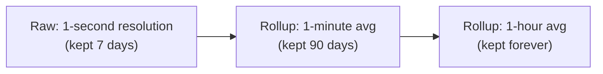

## What it is

A database purpose-built for data that's fundamentally a sequence of
(timestamp, value) points — metrics, sensor readings, prices —
optimized for the access patterns that shape actually needs: fast
writes of new points arriving in roughly time order, and reads that
aggregate over a time range, rather than looking up one row by id.

## What's actually different from a general-purpose database

- **Write pattern**: near-append-only, roughly time-ordered, extremely
  high volume (a fleet of servers each emitting metrics every few
  seconds). General-purpose databases optimize for a mix of
  reads/writes/updates to arbitrary rows; time-series databases optimize
  specifically for "mostly sequential appends."
- **Storage layout**: data is typically stored column-oriented and
  partitioned by time range, so a query for "the last hour" only
  touches the relevant partition, and similar values (a metric that
  barely changes minute to minute) compress extremely well sitting next
  to each other.
- **Downsampling / retention**: raw per-second data from a year ago is
  rarely useful at that resolution — time-series databases build in
  automatic rollups (per-second → per-minute → per-hour averages) and
  expiry policies, rather than requiring an application-level cron job
  to do it.

## Where it applies

Infrastructure metrics and monitoring (Prometheus, InfluxDB), IoT
sensor data, financial tick data. This is exactly what backs the
"metrics" leg of [Observability](/nuggets/observability) — a metrics
backend at any real scale is a time-series database, not a
general-purpose one, precisely because of the write volume and
downsampling needs above.

## Key insight

Forcing high-volume timestamped data into a general-purpose database
works at small scale but breaks down on both ends at once — write
throughput suffers because the database isn't optimized for sequential
appends, and storage balloons because nothing is downsampling old data
automatically. A time-series database is a genuinely different set of
engineering tradeoffs, not just a relational database with a timestamp
column.
