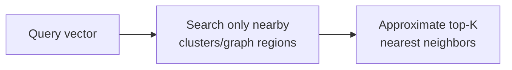

## What it is

A database built to store high-dimensional **vectors**: numeric arrays,
often hundreds to thousands of dimensions, produced by an embedding
model to represent the "meaning" of a piece of text, image, or audio.
It answers **similarity search** — "find the vectors closest to this
one," not an exact-match lookup.

## Why a normal index doesn't work here

A B-tree index (see [Database Indexing](/nuggets/database-indexing)) is
built for exact-match and range queries on ordered scalar values:
there's no meaningful "sort order" for a 768-dimension vector that a
B-tree could exploit. Finding the true nearest neighbors requires
comparing the query vector against every stored vector (`O(n)`), which
doesn't scale.

## Approximate nearest neighbor (ANN)

Vector databases trade perfect accuracy for speed via **approximate**
nearest-neighbor search, close enough almost always, at a fraction of
the cost of checking every vector:

- **HNSW** (Hierarchical Navigable Small World) — builds a multi-layer
  graph where each vector links to its approximate neighbors; search
  starts at a sparse top layer and descends, narrowing in on the right
  neighborhood without visiting most of the graph.
- **IVF** (Inverted File Index) — clusters vectors ahead of time, and a
  query only searches the clusters nearest the query vector, not all of
  them.

Both trade some recall (might miss the true single-closest vector
occasionally) for search that's orders of magnitude faster than an
exhaustive scan: the same kind of tradeoff
[Database Indexing](/nuggets/database-indexing) makes for scalar data,
applied to similarity instead of equality.

## Where it applies

Semantic search (find documents *similar in meaning*, not just matching
keywords), recommendation systems, RAG (retrieval-augmented generation)
pipelines feeding relevant context to an LLM: directly relevant to how
a tool built on [MCP](/nuggets/mcp-vs-api) might retrieve context for a
model. Pinecone, Weaviate, and pgvector (a Postgres extension) are
common implementations; several general-purpose databases now bolt on
vector search rather than requiring a fully separate system.

## The real difference

What's actually new here is the *query*, not the storage: "what's
similar" instead of "what matches exactly." That's why vector databases
need their own indexing structures (HNSW, IVF), entirely different from
a B-tree, even though the raw vectors could technically be stored in
any database that can hold an array column.
