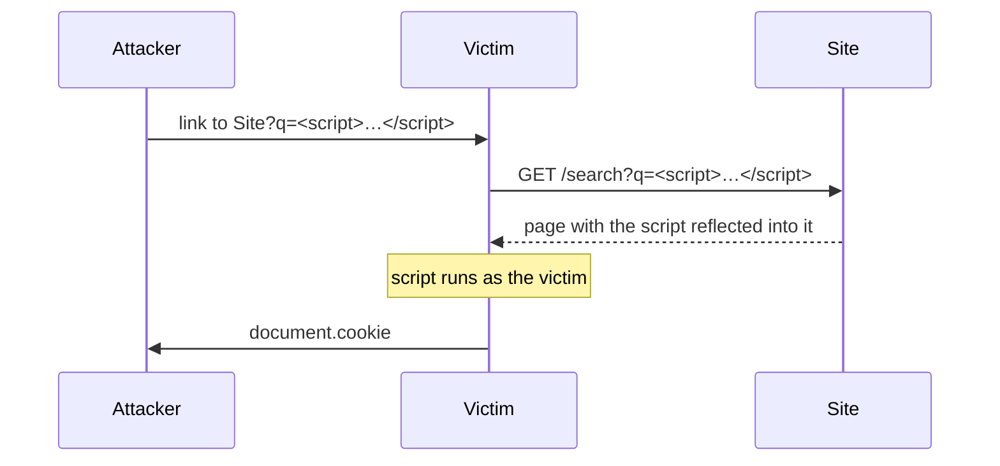

## What it is

Cross-site scripting (XSS): an attacker gets their own JavaScript to run in
another user's browser, in the context of your site. It happens whenever
untrusted input is written into a page without being encoded for the place
it lands.

```js
// vulnerable — comment text is parsed as HTML, so <script> runs
container.innerHTML = `<p>${comment}</p>`;
```

If `comment` is ``,
that code runs for everyone who views the comment.

Three common shapes:

- **Stored** — the payload is saved (a comment, a profile field) and served
  to every viewer.
- **Reflected** — the payload rides in a request (a URL query param) and is
  echoed straight back into the response.
- **DOM-based** — client-side JS reads attacker-controlled input
  (`location.hash`, `postMessage`) and writes it into the DOM.

## Why it matters

The injected script runs with the victim's session and origin. It can read
cookies and tokens, make authenticated requests as the user, log
keystrokes, rewrite the page, or pivot to other attacks. It's a permanent
fixture of the OWASP Top 10, and the vulnerable line usually looks
completely ordinary.



## The fix: context-aware output encoding

Encode data for the context it's being inserted into — HTML body, HTML
attribute, JavaScript string, and URL each need different escaping. In
practice, don't do this by hand: use a templating layer that auto-escapes,
and let the framework build the DOM. React, for example, escapes any string
you interpolate into JSX; you only get XSS back if you reach for
`dangerouslySetInnerHTML`, `innerHTML`, `eval`, or `document.write` with
untrusted data.

Layer on a **Content-Security-Policy** header as defense in depth — it can
block inline scripts and unknown script origins even if an injection slips
through — and set session cookies `HttpOnly` so a successful XSS still can't
read them (see [Session vs. Token Authentication](/nuggets/session-vs-token-auth)).

## Where it applies

Anywhere untrusted data reaches the DOM: user-generated content, URL
parameters, `postMessage` payloads, `Referer`, even "safe-looking" fields
like display names and error messages. Treat every one of them as hostile
until it's been through the encoder.

## The actual rule

Same bug class as [SQL injection](/nuggets/sql-injection): untrusted input
ending up interpreted as code. The fix has the same shape — keep data and
code separate, and let the platform encode at the boundary — not
"strip out `<script>`", which attackers route around with event handlers,
`javascript:` URLs, and encoding tricks.
